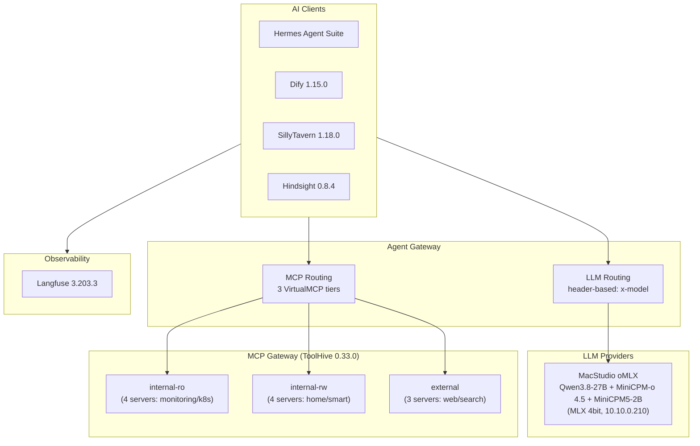

# AI Infrastructure Summary
Last updated: 2026-09-21

Source: Flux manifests in `kubernetes/apps/`.

## Architecture Overview



## Agent Gateway — Central LLM + MCP Router

The agent gateway is the single entry point for all AI traffic. Every AI app routes through it — no app talks to an LLM or MCP server directly.

### LLM Lanes (header-based routing on `/chat`; model id == studio alias)

Two faces on the same backends — the guarded/open split applies to LLM
content only:

| Route | promptGuard | Consumers |
| ----- | ----------- | --------- |
| `/chat` | **guarded** (request+response, `llm-guardrails`) | hermes-agent, machine extractors, open-webui aux provider |
| `/chat/raw` | none (open content lane) | open-webui main chat, eval — **`complex` only** |

| Route Header | Backend | Alias | Model | Host |
| ------------ | ------- | ----- | ----- | ---- |
| `x-model: complex`, `x-priority: high`, or catch-all | `llm-backend-complex` | `complex` | Qwen3.8-27B Uncensored (MLX 4bit) | MacStudio oMLX |
| `x-model: omni` | `llm-backend-omni` | `omni` | MiniCPM-O-4.5 (text+vision+audio-in) | MacStudio oMLX |
| `x-model: micro` | `llm-backend-micro` | `micro` | MiniCPM5-2B | MacStudio oMLX |

The catch-all rule (last on the guarded route) sends unknown/absent model ids
to `complex` — the main brain is the default. The open lane deliberately
serves **only** `complex`: it is the single uncensored model and the only
reason the lane exists; `omni`/`micro` are reachable exclusively through the
guarded route. All backends speak the OpenAI-compatible API on
`studio.homelab.internal:8000`. Auth is ExternalSecret-managed API keys at
the gateway; no cloud fallback is configured — the studio is a deliberate
SPOF. Tool access from the open lane is identical to the guarded one: MCP
has no open route (see MCP Backend).


Lane-fit guidance: `micro` fits classification, tagging, title/routing decisions, short structured extraction (MiniCPM5-2B is text-only — never a vision candidate). `omni` covers everything fidelity-sensitive: summarization, compression, session search, memory writes, OCR/vision (MiniCPM5-2B's long-context recall AA-LCR 59% and abstention bias make it unsafe for those). `complex` for agentic reasoning and hard synthesis.

`micro` uses **MiniCPM5-2B** (Apache-2.0, 2.6B dense, official 4-bit MLX port `openbmb/MiniCPM5-2B-MLX`, ~2.6 GB resident on the studio) for cheap, low-latency work: classification, extraction, tagging, short summaries, and as the classifier for semantic routing. Serve it with thinking disabled (`chat_template_kwargs: {"enable_thinking": false}`) and constrained JSON output for label safety. The studio alias must be `micro` (host-side registry, see Studio Model Registry).

`omni` uses **MiniCPM-O-4.5** (Apache-2.0, 9B omni: Qwen3-8B backbone + vision/audio encoders; OpenCompass 77.6, OCRBench 876) served on the studio (alias `omni`, ~7 GB at MLX 4bit). All `fast`/`memory`/`vision` consumers (firecrawl, karakeep text+image, home-assistant-sgcc OCR, hindsight memory, trendradar digest, frigate-vision camera events, hermes aux side-tasks) use `omni`. Not on omni: `complex` (agentic main brain), `micro` (stays — a 2.6 GB classifier/router shouldn't cost a 9B call), embeddings/reranker (aliases `embedding`/`reranker`). ASR: no deployment — no current consumer; when one appears, pick a lane deliberately.


### Intranet exposure

The gateway API surface is exposed to the intranet via `kgateway-internal` (10.10.0.131) at `https://api.noirprime.com` (`/chat`, `/mcp`, `/v1/*` media; dashboard stays on `https://ai.noirprime.com/ui`):

- `/chat` — guarded LLM lane (strict API key, 300s timeout, promptGuard guardrails)
- `/chat/raw` — open LLM lane (strict API key, 300s timeout, no promptGuard; LLM content only — tools are still guarded via /mcp/*)
- `/mcp/ro`, `/mcp/rw`, `/mcp/ext` — tiered MCP routing (strict API key, mcp-guardrails ExtMCP on every tier, FailClosed)
- `/v1/embeddings`, `/v1/rerank` — media passthrough to studio (strict API key, no LLM parsing)
  (dashboard UI lives separately at `https://ai.noirprime.com/ui`)

TLS terminates at kgateway (cert-manager `noirprime-com-tls`, wildcard `*.noirprime.com`); external-dns auto-creates the AdGuardHome record. Machine clients authenticate with agentgateway API keys — no SSO extAuth on API paths. Reachable from trusted VLANs (10/100/200); IoT VLAN 210 is ACL-blocked from RFC1918.

### App → model lane

| App                  | Lane              | Model              | Notes                                                        |
| -------------------- | ----------------- | ------------------ | ------------------------------------------------------------ |
| hermes-agent         | `complex`         | Qwen3.8-27B        | Agentic reasoning / KB QA / automation; aux side-tasks on `omni`/`micro` (GitOps configmap) |
| hindsight            | `omni`            | MiniCPM-o 4.5      | Extraction-dominant (single-model constraint); embeddings + reranker via gateway media routes |
| firecrawl            | `omni`            | MiniCPM-o 4.5      | Batch page extraction/summarization                          |
| karakeep             | `omni`            | MiniCPM-o 4.5      | Text + image tagging (unified); embeddings via `/v1/embeddings` (alias `embedding`, 1024d) |
| trendradar           | `omni`            | MiniCPM-o 4.5      | News digest (`openai/omni`; `micro` fallback); egress-isolated MCP group member |
| home-assistant-sgcc  | `omni`            | MiniCPM-o 4.5      | Meter/bill photo OCR                                         |
| SillyTavern          | UI-configured     | Gemma4-31B lane    | Creative/RP; no repo-level config                            |
| open-notebook        | UI-configured     | suggest `complex`  | Research synthesis; no repo-level config                     |
| open-webui           | `/chat/raw` + `/chat` | `complex` (open) / `omni`·`micro` (guarded) | Chat portal; native tools via the guarded tiered `/mcp/*` (bearer key); no hermes provider |

All `omni`/`micro` consumers (extractors + hermes aux) ride the **guarded**
`/chat` route; their prompts carry scraped web content, so a low rate of
promptGuard false-positive rejections (403) is expected and watched — see
the TODO table.

### MCP Backend — tiered, guarded, no open lane

One gateway endpoint per ToolHive group (each rule rewrites its tier prefix
to the canonical `/mcp` upstream):

- `/mcp/ro` → `vmcp-internal-ro` — read-only monitoring/k8s tools
- `/mcp/rw` → `vmcp-internal-rw` — read-write home/smart tools
- `/mcp/ext` → `vmcp-external` — external web/search tools

All three backends carry the mcp-guardrails ExtMCP sidecar (agentgateway
`mcp.guardrails`): `tools/call` is scanned request+response, `tools/list` /
`prompts/get` / `resources/read` response-only; `failureMode: FailClosed`
(the sidecar being down disables tool traffic cluster-wide rather than
passing it unguarded). There is deliberately **no** unguarded MCP route —
open-webui and hermes consume the same guarded endpoints; only the LLM
content lanes differ. Auth: strict API key (`mcp-api-auth`). Direct vmcp
access is cilium-restricted to the gateway federation and vmagent metrics.

---

## LLM Inference — Local

All lanes run on the MacStudio inference host (`complex` Qwen3.8-27B, `omni` MiniCPM-o 4.5, `micro` MiniCPM5-2B). The in-cluster llama.cpp deployment (`llama-qwen3`) was archived 2026-08-28 (`.archived/kubernetes/servitor/llama`); its 50Gi CephFS PVC `llama` is retained for manual cleanup. Qwen3.5-4B was retired 2026-09-09 with the `fast`/`memory`/`vision` lane removal.

---

## AI Agent Platform

### Hermes Agent Suite

| Component | Port | Notes                       |
| --------- | ---- | --------------------------- |
| Dashboard | 9119 | SSO-protected               |
| Gateway   | 8642 | Internal, health: `/health` |
| Web UI    | 8787 | Deployed, no ingress (chat moved to Open WebUI; SSO route removed 2026-09-09) |

- **Runtime**: Kata Containers (VM isolation)
- **Resources**: req: 200m CPU / 1Gi RAM, lim: 4Gi RAM
- **Integrations**: Feishu (plugin `plugins/platforms/feishu`, WebSocket mode, the only messaging platform), Firecrawl (internal), ToolHive MCP, Agent Gateway LLM
- **Egress**: CiliumNetworkPolicy — agentgateway-proxy:80 (L7: POST `/chat/*` + `/mcp/*` only), kube-dns, open.feishu.cn:443. No direct vmcp access — MCP goes through the guarded tiered `/mcp/*` endpoints like every other client
- **Depends on**: `agentgateway` (Flux dependency)
- **Profiles** (seeded declaratively by the `seed-config` initContainer from `configmap.yaml`; dashboard edits to `config.yaml`/profile files revert on restart):
  - `ops` — the batching brain: cron/Feishu/automation workload lives here (read-only-first posture, ToolHive tiers as today); Feishu home channel for cron results
  - `chat` — external chat-like frontends (no longer open-webui, which uses the gateway directly): isolated memory + config, own `API_SERVER_KEY` (scoped secret, 1Password `chat_api_server_key`); multiplexed gateway serves it at `:8642/p/chat/v1` with served model id `chat` (per-profile model names are NOT supported under multiplexing — the id is the profile name); no `API_SERVER_KEY` is seeded for `ops`, so `/p/ops/` API fails closed
  - `default` — left untouched as fallback/scratch
  Model/provider config (`model.provider: custom` → agent gateway, `model.default: complex`) and aux side-tasks (`vision`/`web_extract`/`session_search`/`compression` → `omni`, `title_generation` → `micro`) are GitOps-managed in `configmap.yaml`; the gateway's PreRouting transformation maps body `model` → `x-model` header, so lane names are model names. Requires new 1Password `hermes-agent` fields: `api_server_key`, `chat_api_server_key` (both >=16 chars)
  Rationale: profile isolation keeps interactive-chat memory out of the automation brain (and vice versa) without a second deployment; graduate to a separate write-enabled instance only if interactive chat needs `internal-rw` tools

---

## LLM Application Platform

### Dify 1.15.0

| Component     | Image                                       | Resources                    |
| ------------- | ------------------------------------------- | ---------------------------- |
| api           | `langgenius/dify-api:1.15.0`                | req: 100m / 512Mi, lim: 1Gi  |
| web           | `langgenius/dify-web:1.15.0`                | req: 20m, lim: 256Mi         |
| worker        | `langgenius/dify-api:1.15.0`                | req: 200m / 1Gi, lim: 2Gi    |
| beat          | `langgenius/dify-api:1.15.0`                | req: 10m / 128Mi, lim: 256Mi |
| sandbox       | `langgenius/dify-sandbox:0.2.15`            | req: 20m, lim: 1Gi (Kata)    |
| proxy         | `ubuntu/squid:5.2-22.04_beta`               | req: 20m, lim: 256Mi         |
| plugin-daemon | `langgenius/dify-plugin-daemon:0.6.3-local` | req: 20m, lim: 1Gi           |

- **Backends**: CloudNativePG (PGVector), Dragonfly Redis (DB 0/1/2), Ceph S3
- **Sandbox**: Kata Containers, max_workers=4, routes egress through squid proxy
- **Model providers**: Configured at runtime via Dify admin UI, not in manifests
- **Depends on**: proxy → database → sandbox → api → (worker, beat, web)

### Open WebUI v0.11.3

- Chat frontend (restored; replaces onyx), app-template, image `ghcr.io/open-webui/open-webui:v0.11.3`. Lives in **servitor-apps** (with hermes/toolhive, not selfhosted-apps). Storage is externalized: shared CNPG `postgres` (app data + `VECTOR_DB=pgvector`; role/db via `postgres-init`, plain `vector` ext self-created by migrations — vchord N/A: open-webui hardcodes pgvector DDL), app `Dragonfly` (`REDIS_URL`), app ceph bucket `open-webui` (`STORAGE_PROVIDER=s3`, `STORAGE_LOCAL_CACHE=False`) — data dir is emptyDir cache, no PVC
- **LLM providers** (`OPENAI_API_BASE_URLS` order, keys match): 1. agentgateway open lane (`agentgateway-proxy:80/chat/raw`, key `llm-api.agentgateway_api_auth`) — serves **only** `complex`, the uncensored main brain; any model id falls through to the complex catch-all; 2. agentgateway guarded lane (`agentgateway-proxy:80/chat`, same key) — promptGuard-scanned, hosts `omni`/`micro` for aux tasks (title generation → model id `micro`); select per-task in Admin Settings. The former siliconflow and hermes chat-profile providers were removed — the gateway is the only AI egress.
- **MCP**: native MCP tool servers via `TOOL_SERVER_CONNECTIONS` = the three tiered, sidecar-guarded gateway endpoints (`agentgateway-proxy:80/mcp/ro|rw|ext`) with `auth_type: "bearer"` and the key expanded from `$GATEWAY_API_KEY` (kubelet dependent-env expansion; bearer auth in `build_tool_server_headers` is native on v0.11.3). Same guarded endpoints hermes uses — MCP has no open lane.
- Ingress: `chat.noirprime.com` via kgateway-internal; **auth is authentik forward-auth at the gateway** (components/authentik, provider `open-webui-proxy-provider`, homelab-admin group); open-webui's own login disabled (`WEBUI_AUTH=False`)
- **Egress**: CiliumNetworkPolicy — agentgateway-proxy:80 (sole AI egress: LLM + MCP), open-webui-terminals:3000, open-webui-oikb:8080, postgres-rw:5432, open-webui-dragonfly:6379, ceph RGW:80, kube-dns, world-except-private (RAG web fetching)
- **Sandbox suite**: `open-webui-terminals` (orchestrator, `kubernetes` backend, Role-limited to pods/services/pvcs in servitor-apps, state on shared CNPG via `TERMINALS_DATABASE_URL`) spawns per-user `open-terminal:slim` sandboxes — cluster access MCP-only (vMCP:4483), internet minus private ranges; `open-webui-oikb` (0.4.0 daemon) syncs Knowledge Bases from external sources, config `sources: []` until KBs are defined (stateless by design: diff state lives server-side, sync history is disposable)

### Media lanes (studio-hosted, OpenAI-compatible)

Non-chat vector modalities run on the same oMLX process as the chat lanes and are exposed through the agent gateway as **plain HTTP passthrough** (no LLM parsing) on `agentgateway-media-route`, guarded by the same `llm-api-auth` API keys as `/chat`:

| Path             | Studio port | Server process | Alias       | Model                                   | Timeout |
| ---------------- | ----------- | -------------- | ----------- | --------------------------------------- | ------- |
| `/v1/embeddings` | 8000        | oMLX           | `embedding` | Qwen3-Embedding-0.6B (1024d)            | 120s    |
| `/v1/rerank`     | 8000        | oMLX           | `reranker`  | Qwen3-Reranker-0.6B (Cohere-compatible) | 120s    |

The ComfyUI `image`/`voice` lanes (`:8001`, `/v1/images`, `/v1/audio`) were retired: not LLM-type, no in-cluster consumers — plain media passthrough gains nothing from gateway policy. Re-add as a direct route if a consumer ever appears.

Config: `kubernetes/apps/networking-system/agentgateway/config/media/` — single static `AgentgatewayBackend` `studio-server` (oMLX, :8000), route on `agentgateway-proxy`. Clients use `https://api.noirprime.com` as base URL with their gateway API key. karakeep and hindsight vector stores were rebuilt for the 0.6B/1024d embedding space (no data was preserved).

---

## MCP Gateway

### ToolHive 0.33.0 (Stacklok)

- **Operator**: namespace-scoped RBAC
- **Embedding Server**: 2 replicas, req: 500m/512Mi, lim: 2 CPU/1Gi, 5Gi model cache
- **3 Virtual MCP Servers** with:
  - Hybrid semantic search (0.6 semantic / 0.4 keyword ratio)
  - Circuit breaker (3 failures → 30s timeout)
  - OTEL telemetry (5% sampling)
- **Ingress restricted**: only agentgateway-proxy (MCP protocol, tiered `/mcp/*`) and vmagent (metrics scrape) can connect; chat frontends reach tools through the gateway, never directly

### MCP Servers (13 total)

#### internal-ro (read-only, no egress)

| Server        | Transport             | Connects To                   |
| ------------- | --------------------- | ----------------------------- |
| victoria-logs | HTTP :8081            | VictoriaLogs                  |
| kubernetes    | HTTP :8080            | kube-apiserver (read-only SA) |
| grafana       | Streamable HTTP :8000 | Grafana                       |
| fluxcd        | HTTP :9090            | Flux (read-only SA)           |
| trendradar    | Streamable HTTP :8080 (proxy→:3333) | TrendRadar news DB |
| obsidian      | stdio (filesystem MCP) | Obsidian vault, read-only NFS copy (`/volume1/backup/dropbox/Obsidian/noirprime`) |

#### internal-rw (read-write, no egress)

| Server         | Transport            | Connects To            |
| -------------- | -------------------- | ---------------------- |
| home-assistant | HTTP (FastMCP) :8086 | Home Assistant         |
| hindsight      | HTTP proxy :8080     | Hindsight MCP endpoint |
| forgejo        | Streamable HTTP :8080 | Forgejo on nas:9003 (forgejo-mcp v3.0.0); draftbox repo read+write, repo-scoped PAT |

#### external (full egress)

| Server    | Transport             | Notes                    |
| --------- | --------------------- | ------------------------ |
| github    | HTTP :8082            | Read-only PAT, 7 tools   |
| firecrawl | Streamable HTTP :3000 | Local Firecrawl instance |
| context7  | stdio :3000           | Context7 API             |

#### Obsidian facts workflow

Plain-text pipeline, no extra copies: Obsidian → Dropbox (canonical; its own sync/revisions) → Synology CloudSync pull → `/volume1/backup` on the NAS → `obsidian` MCP serves the vault read-only over NFS (static PV, subDir `backup/dropbox/Obsidian/noirprime`) for agent fact lookup. Agent-authored notes never write back into the vault copy — they go to the **draftbox** git repo on Forgejo (`nas.homelab.internal:9003`) via the `forgejo` MCP (`create_file`/`update_file`, commit-per-call), keeping generated drafts versioned and reviewable before any manual promotion into the vault.

---

## LLM Observability

### Langfuse 3.203.3

| Component | Image                                      | Resources            |
| --------- | ------------------------------------------ | -------------------- |
| web       | `ghcr.io/langfuse/langfuse:3.203.3`        | req: 1 CPU, lim: 2Gi |
| worker    | `ghcr.io/langfuse/langfuse-worker:3.203.3` | req: 2 CPU, lim: 4Gi |

- **Backends**: ClickHouse (analytics), Dragonfly Redis (cache/queue), Ceph S3 (events/exports), CloudNativePG (metadata)
- **Features**: Experimental features enabled, telemetry disabled

---


### TrendRadar 6.10.0

- AI news digest pipeline (selfhosted-apps): community hot-list (47 sources, issue #95) + custom RSS watch list (aiera.com.cn, expreview.com + GitHub Atom placeholders); `report.mode: incremental` (zero-duplicate push), keyword grouping (科技 topic covers both portals), AI analysis via gateway (`openai/omni`, fallback `micro`)
- Delivery: Feishu custom group robot (`FEISHU_WEBHOOK_URL` from 1Password `feishu.webhook_url`); HTML report at `news.noirprime.com` (SSO)
- MCP server (:3333) registered as `trendradar` in internal-ro — hermes/agents can query stored news
- Config fully in ConfigMap (`config.yaml` + `frequency_words.txt` + `ai_interests.txt`); output on 1Gi ceph-block PVC

## AI-Adjacent Services

### Vision alerting (frigate-vision)

Frigate remains the 24/7 trigger layer; MiniCPM-o 4.5 is the event describer. `smarthome-apps/frigate-vision` (python bridge, ConfigMap-mounted): MQTT `frigate/events` (`end` type, label-filtered) → snapshot from frigate :5000 → `omni` lane (image-in, JSON `{description, severity}` out) → severity ≥ `MIN_SEVERITY` (default medium) → HA `persistent_notification` **and** hermes webhook `POST :8644/p/ops/webhooks/frigate-alert` (V2 HMAC) — the `ops` profile ingests it as a user message, so the batching brain sees camera events in context with everything else it knows. Webhook route is declared in the GitOps-managed default `config.yaml` (`platforms.webhook.extra.routes`, HMAC secret via `FRIGATE_WEBHOOK_SECRET` in 1Password). 1Password additions: `home-assistant.hass_token`, `hermes-agent.frigate_webhook_secret`.

### SillyTavern 1.18.0

- AI character chat frontend, `ghcr.io/sillytavern/sillytavern:1.18.0`, port 8000
- Discreet login (user accounts disabled), local-only persistence

### Firecrawl

- Web scraping pipeline for AI data ingestion
- 3 containers: api (:3002), nuq-worker (:3006), playwright-service (:3000)
- `ghcr.io/firecrawl/firecrawl:latest`, Kata runtime
- Backed by SearXNG, Dragonfly Redis, nuq-postgres
- Exposed as MCP server + internal endpoint for Hermes

### Open-Notebook 1.14.0

- AI-powered research notebook, `ghcr.io/lfnovo/open-notebook:1.14.0`
- UI (:8502 Streamlit) + REST API (:5055), SurrealDB backend
- No public ingress

### Hindsight 0.10.0

- AI memory / context store (agent long-term memory: retain / recall / reflect)
- Image: upstream `ghcr.io/vectorize-io/hindsight:0.10.0-slim` — no in-process local-ml
- LLM: `omni` lane → **MiniCPM-O-4.5 on the MacStudio** (via agentgateway open lane)
- Embeddings: **Qwen3-Embedding-0.6B on the MacStudio** (oMLX, alias `embedding`, 1024d) via gateway `/v1/embeddings`; store rebuilt from scratch for the 0.6B space
- Reranker: **Qwen3-Reranker-0.6B on the MacStudio** (Cohere-compatible, alias `reranker`) via gateway `/v1/rerank`
- Resources: req: 200m CPU / 512Mi, lim: 2 CPU / 2Gi
- Storage: CloudNativePG (vchord vector + pgroonga text search), OTEL enabled
- Exposed as MCP server for agent context retrieval

### Archived

- **Buzz** (relay + buzz-agent-omp) — buzz-agent-omp removed 2026-08-28; buzz-relay removed 2026-09-09, superseded by hermes' native webhook ingestion (`/p/<profile>/webhooks/<route>`, HMAC); manifests deleted from git. Its CNPG DB, Dragonfly, and Ceph bucket are retained in-cluster for manual cleanup.
- **Fast-Note-Sync** — removed 2026-09-09, manifests deleted from git; vault facts now: read via `obsidian` filesystem MCP (read-only NFS copy), write via `forgejo` MCP to the draftbox repo. Dropbox MCP was evaluated and rejected (beta, DCR-limited clients, short-lived tokens, cloud round-trip for local data)
- **Devbox** — removed from cluster 2026-08-05; image retained in `soulwhisper/containers` as an ad-hoc exec sandbox.
- **llama.cpp (llama-qwen3)** — archived 2026-08-28; all local lanes moved to the MacStudio.

---

## Shared Infrastructure (all AI apps depend on)

| Service                     | Namespace           | Purpose                                             |
| --------------------------- | ------------------- | --------------------------------------------------- |
| **Agent Gateway**           | `networking-system` | LLM + MCP routing                                   |
| **CloudNativePG**           | `database-system`   | PostgreSQL + PGVector for Dify, Langfuse, Hindsight |
| **Dragonfly**               | Various             | Redis-compatible cache/queue                        |
| **ClickHouse**              | `database-system`   | Langfuse analytics                                  |
| **Ceph (Rook)**             | `storage-system`    | S3 + block + CephFS for model/data storage          |
| **Kata Containers**         | `kube-system`       | VM isolation for sandboxed workloads                |
| **kgateway**                | `networking-system` | API gateway + SSO extAuth                           |
| **Authentik**               | `security-system`   | SSO for all public AI endpoints                     |
| **Cert-Manager**            | `security-system`   | TLS certificates                                    |
| **VictoriaMetrics**         | `monitoring-system` | Metrics for ToolHive + OTEL                         |
| **OpenTelemetry Collector** | `monitoring-system` | Traces/metrics pipeline                             |

## Studio Model Registry

The host-side contract. oMLX and ComfyUI register these exact aliases; the
gateway, lane names, and every consumer address models by alias only
(request body `model` == alias == lane name).

| Order | Alias       | Model                          | Format / size   | Served by |
| ----- | ----------- | ------------------------------ | --------------- | --------- |
| 1     | `complex`   | Qwen3.8-27B Uncensored         | MLX 4bit, ~30G  | oMLX :8000 |
| 2     | `omni`      | MiniCPM-O-4.5                  | MLX 4bit, ~7G   | oMLX :8000 |
| 3     | `micro`     | MiniCPM5-2B                    | MLX 8bit, ~2.6G | oMLX :8000 |
| 4     | `embedding` | Qwen3-Embedding-0.6B (1024d)   | MLX, ~1.3G      | oMLX :8000 (`/v1/embeddings`) |
| 5     | `reranker`  | Qwen3-Reranker-0.6B            | MLX, ~1.3G      | oMLX :8000 (`/v1/rerank`) |

Host prerequisites (out of band): oMLX registered with the five chat/vector
aliases above. (Retired: ComfyUI `image`/`voice` on :8001 — see Media lanes.)

## Non-unified Configuration & TODO

Routes and configs not yet unified under the agent gateway, plus deferred
items:

| Item | State | Path forward |
| ---- | ----- | ------------ |
| open-webui MCP bearer key rollout | Implemented (`auth_type: "bearer"` + `$GATEWAY_API_KEY` expansion); smoke-verify at rollout | Round-trip a native tool call in open-webui; on failure check kubelet dependent-env expansion ordering before anything else |
| promptGuard FP rate on extractor traffic | Extractors (firecrawl/karakeep/trendradar/hindsight/ha-sgcc/frigate-vision) ride the guarded lane with scraped web content in-prompt | Watch gateway 403 rates via langfuse/logs; if painful, re-expose `omni` on the open lane (one route rule) as the designed escape hatch |
| hermes MCP server endpoints | Runtime/PVC state, not in GitOps seeds | Point hermes at `/mcp/ro|rw|ext` at rollout; add an MCP section to the seed ConfigMap once the hermes config schema is confirmed |
| open-terminal sandbox pods → vmcp | Egress allowed, ingress whitelist gap (effectively denies — accidentally enforces the no-open-MCP rule) | Separate PR: add sandbox pods to vmcp-ingress, or drop the egress rule and fix the comment |
| Dify / SillyTavern / open-notebook endpoints | UI-managed, no repo manifests | Self-managed surface; listed for completeness |
| mcp-guardrails P2 (audit volume, explicit HUMAN_REVIEW_MODE) | Deferred, on watch via langfuse decision spans (open-webui and hermes both emit OTEL) | Revisit on the first FP/rejection report; a sidecar outage fail-closes ALL tool traffic — accepted blast radius |
| ASR model | None deployed; no in-repo consumer | Add when a consumer appears |

## Model Routing Summary

```
/chat      (guarded, promptGuard)  ── hermes, extractors, open-webui aux
/chat/raw  (open, complex ONLY)   ── open-webui main chat, eval
            │
            ├─ x-priority: high / x-model: complex / (catch-all) ─► complex  Qwen3.8-27B Uncensored
            ├─ x-model: omni  ───────────────────────────────────► omni     MiniCPM-O-4.5 (text+vision)
            └─ x-model: micro ───────────────────────────────────► micro    MiniCPM5-2B

/mcp/ro /mcp/rw /mcp/ext  (all tiers: mcp-guardrails ExtMCP, FailClosed) ── every MCP client
```

All routing is internal via the agent gateway. No app has direct LLM or MCP server access — the gateway is the single choke point for auth, routing, guardrails, and observability.
