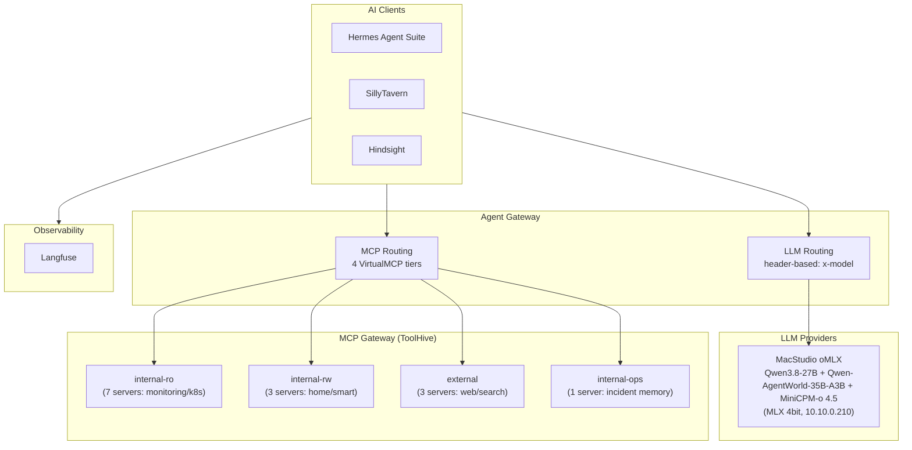

# AI Infrastructure Summary
Last updated: 2026-10-05

Source: Flux manifests in `kubernetes/apps/`.

## Architecture Overview


```mermaid
flowchart TB
    subgraph Clients["AI Clients"]
        Hermes["Hermes Agent Suite"]
        ST["SillyTavern"]
        HS["Hindsight"]
    end

    subgraph Gateway["Agent Gateway"]
        AG-LLM["LLM Routing<br/>header-based: x-model"]
        AG-MCP["MCP Routing<br/>4 VirtualMCP tiers"]
    end

    subgraph LLM["LLM Providers"]
        Studio["MacStudio oMLX<br/>Qwen3.8-27B + Qwen-AgentWorld-35B-A3B + MiniCPM-o 4.5<br/>(MLX 4bit, 10.10.0.210)"]
    end

    subgraph MCP["MCP Gateway (ToolHive)"]
        VMCP-RO["internal-ro<br/>(7 servers: monitoring/k8s)"]
        VMCP-RW["internal-rw<br/>(3 servers: home/smart)"]
        VMCP-EXT["external<br/>(3 servers: web/search)"]
        VMCP-OPS["internal-ops<br/>(1 server: incident memory)"]
    end

    subgraph Obs["Observability"]
        Langfuse["Langfuse"]
    end

    Clients --> AG-LLM
    Clients --> AG-MCP
    AG-LLM --> Studio
    AG-MCP --> VMCP-RO
    AG-MCP --> VMCP-RW
    AG-MCP --> VMCP-EXT
    AG-MCP --> VMCP-OPS
    Clients --> Obs
```

## Agent Gateway — Central LLM + MCP Router

The agent gateway is the single entry point for all AI traffic. Every AI app routes through it — no app talks to an LLM or MCP server directly.

### LLM lanes

One route, one path: `POST /v1/chat/completions`. The guarded/open split is
a **model name** (body `model` → `x-model` header via the gateway-wide
PreRouting transform); guardrails attach to the guarded rules by section
name:

| Client model | promptGuard | Backend | Model (studio id) |
| ------------ | ----------- | ------- | ----------------- |
| `uncensored` | none (open lane) | `llm-backend-complex` | Qwen3.8-27B Uncensored (`qwen3.8-27b`, MLX 4bit) — pure chat only |
| `agent` | **guarded** | `llm-backend-agent` | Qwen-AgentWorld-35B-A3B (`qwen-agentworld-35b-a3b`, MLX oQ4) — AI-ops automation |
| `omni` | **guarded** | `llm-backend-omni` | MiniCPM-O-4.5 (`minicpm-o-4.5`, text+vision+audio-in) |

Consumer base URLs
are `.../v1` — OpenAI/litellm clients append `/chat/completions`
themselves; raw-HTTP consumers must use the full path.

There is no catch-all: an unknown or missing model id matches no rule and
the gateway answers `404`. `uncensored` is the only unguarded model — the
single uncensored brain. `omni` is reachable exclusively
guarded. All backends
speak the OpenAI-compatible API on `studio.homelab.internal:8000` and
inject the oMLX server key via `policies.auth.secretRef`
(`studio-api-auth`). Consumers authenticate with ExternalSecret-managed
API keys; there is no cloud fallback — the studio is a deliberate SPOF.


MCP has no open route (see MCP Backend).


Lane-fit guidance: `omni` covers everything fidelity-sensitive: summarization, compression, session search, memory writes, OCR/vision, plus classification, tagging, title/routing decisions and short structured extraction. `agent` for AI-ops automation: alert RCA, ScheduledHealthChecks, MCP batch tool workloads. `uncensored` for pure human chat (RP/creative/open-ended) only.

`omni` uses **MiniCPM-O-4.5** (Apache-2.0, 9B omni: Qwen3-8B backbone + vision/audio encoders; OpenCompass 77.6, OCRBench 876) served on the studio (studio id `minicpm-o-4.5`, ~7 GB at MLX 4bit). All `fast`/`memory`/`vision` consumers (firecrawl, karakeep text+image, home-assistant-sgcc OCR, hindsight memory, trendradar digest, frigate event descriptions (native GenAI), hermes aux side-tasks) use `omni`. Not on omni: `agent` (automation main brain), `uncensored` (pure-chat brain), embeddings/reranker (studio ids `qwen3-embedding-0.6b`/`qwen3-reranker-0.6b`). ASR: no deployment — no current consumer; when one appears, pick a lane deliberately.

### Intranet exposure

The gateway API surface is exposed to the intranet via `kgateway-internal` (10.10.0.131) at `https://api.noirprime.com` (`/v1/*`, `/mcp`; dashboard stays on `https://ai.noirprime.com/ui`):

- `/v1/chat/completions` — LLM lanes (strict API key; promptGuard on all but `uncensored`)
- `/v1/models` — gateway-synthesized lane discovery (`studio-models` directResponse; keep in sync with Studio Model Registry)
- `/v1/embeddings`, `/v1/rerank`, `/v1/audio/*` — media lanes via LLM-pipeline backends (strict API key)
- `/mcp/ro`, `/mcp/rw`, `/mcp/ext`, `/mcp/ops` — tiered MCP routing (strict API key, mcp-guardrails ExtMCP on every tier, FailClosed)
  (dashboard UI lives separately at `https://ai.noirprime.com/ui`)

TLS terminates at kgateway (cert-manager `noirprime-com-tls`, wildcard `*.noirprime.com`); external-dns auto-creates the AdGuardHome record. Machine clients authenticate with agentgateway API keys — no SSO extAuth on API paths. Reachable from trusted VLANs (10/100/200); IoT VLAN 210 is ACL-blocked from RFC1918.

### App → model lane

| App                  | Lane              | Model              | Notes                                                        |
| -------------------- | ----------------- | ------------------ | ------------------------------------------------------------ |
| hermes-agent         | `agent`           | Qwen-AgentWorld-35B-A3B | Agent brain: automation / KB QA / ops batching; aux side-tasks on `omni` (GitOps configmap) |
| robusta (holmes)     | `agent`           | Qwen-AgentWorld-35B-A3B | Alert RCA + ScheduledHealthChecks; 3-25x faster than 27b on tool workloads (measured 2026-10); temperature 0.6 per model tuning |
| hindsight            | `omni`            | MiniCPM-o 4.5      | Extraction-dominant (single-model constraint); embeddings + reranker via gateway media routes |
| firecrawl            | `omni`            | MiniCPM-o 4.5      | Batch page extraction/summarization                          |
| karakeep             | `omni`            | MiniCPM-o 4.5      | Text + image tagging (unified); embeddings via `/v1/embeddings` (model `embedding`, 1024d) |
| trendradar           | `omni`            | MiniCPM-o 4.5      | News digest (`openai/omni`); egress-isolated MCP group member |
| home-assistant-sgcc  | `omni`            | MiniCPM-o 4.5      | Meter/bill photo OCR                                         |
| SillyTavern          | `uncensored`      | Qwen3.8-27B        | Creative/RP; UI-configured, no repo-level config |
| open-notebook        | UI-configured     | suggest `uncensored` | Research synthesis; no repo-level config                     |
| open-webui           | `/v1`             | `uncensored` (open) / `agent`·`omni` (guarded) | Human chat portal; native tools via the guarded tiered `/mcp/*` (bearer key) |

All `omni` consumers (extractors + hermes aux) ride the **guarded**
`/v1` lane; their prompts carry scraped web content, so a low rate of
promptGuard false-positive rejections (403) is expected and watched — see
the TODO table.

### MCP Backend — tiered, guarded, no open lane

One gateway endpoint per ToolHive group (each rule rewrites its tier prefix
to the canonical `/mcp` upstream):

- `/mcp/ro` → `vmcp-internal-ro` — read-only monitoring/k8s tools
- `/mcp/rw` → `vmcp-internal-rw` — read-write home/smart tools
- `/mcp/ext` → `vmcp-external` — external web/search tools
- `/mcp/ops` → `vmcp-internal-ops` — ops incident memory (hindsight ops bank)

All four backends carry the mcp-guardrails ExtMCP sidecar (agentgateway
`mcp.guardrails`): `tools/call` is scanned request+response, `tools/list` /
`prompts/get` / `resources/read` response-only; `failureMode: FailClosed`
(the sidecar being down disables tool traffic cluster-wide rather than
passing it unguarded). There is deliberately **no** unguarded MCP route —
open-webui and hermes consume the same guarded endpoints; only the LLM
content lanes differ. Auth: strict API key (`mcp-api-auth`). Direct vmcp
access is cilium-restricted to the gateway federation and vmagent metrics.
---

## LLM Inference — Local

All lanes run on the MacStudio inference host (`uncensored` Qwen3.8-27B, `agent` Qwen-AgentWorld-35B-A3B, `omni` MiniCPM-o 4.5). The in-cluster llama.cpp deployment (`llama-qwen3`) was archived 2026-08-28; its 50Gi CephFS PVC `llama` is retained for manual cleanup. Qwen3.5-4B was retired 2026-09-09 with the `fast`/`memory`/`vision` lane removal.

---

## AI Agent Platform

### Hermes Agent Suite

| Component | Port | Notes                       |
| --------- | ---- | --------------------------- |
| Dashboard | 9119 | SSO-protected               |
| Gateway   | 8642 | Internal, health: `/health` |
| Web UI    | 8787 | Deployed, no ingress (chat moved to Open WebUI; SSO route removed 2026-09-09) |

- **Runtime**: user namespaces (`hostUsers: false`) + egress CNP (ADR-03; Kata removed)
- **Resources**: req: 200m CPU / 1Gi RAM, lim: 4Gi RAM
- **Integrations**: Feishu (plugin `plugins/platforms/feishu`, WebSocket mode, the only messaging platform), Firecrawl (internal), ToolHive MCP, Agent Gateway LLM
- **Egress**: CiliumNetworkPolicy — agentgateway-proxy:80 (L7: POST `/v1/*` + `/mcp/*` only), kube-dns, world-except-private :443 (Feishu WebSocket). No direct vmcp access — MCP goes through the guarded tiered `/mcp/*` endpoints like every other client
- **Ingress**: caller-scoped CNP (#3934) — dashboard :9119 + webhook ingest :8644 via kgateway-internal (shared rule), webhook ingest :8644 also from frigate + LAN, profile API :8642/:8787 same-namespace only; `fromEntities: host` keeps kubelet probes working
- **Depends on**: `agentgateway` (Flux dependency)
- **Profiles** (seeded declaratively by the `seed-config` initContainer from `configmap.yaml`; dashboard edits to `config.yaml`/profile files revert on restart):
  - `ops` — the batching brain: cron/Feishu/automation workload lives here (read-only-first posture, ToolHive tiers as today); Feishu home channel for cron results
  - `default` — fallback/scratch; the retired `chat` profile was removed 2026-10 when open-webui became the human interface (it talks to the gateway directly)
  Model/provider config (`model.provider: custom` → agent gateway, `model.default: agent`) and aux side-tasks (`vision`/`web_extract`/`session_search`/`compression`/`title_generation` → `omni`) are GitOps-managed in `configmap.yaml`; the gateway's PreRouting transformation maps body `model` → `x-model` header, so lane names are model names. Requires 1Password `hermes-agent` field: `api_server_key_root` (>=16 chars)

---

### Open WebUI

- Chat frontend (restored; replaces onyx), app-template, image `ghcr.io/open-webui/open-webui`. Lives in **servitor-apps** (with hermes/toolhive, not selfhosted-apps). Storage is externalized: shared CNPG `postgres` (app data + `VECTOR_DB=pgvector`; role/db via `postgres-init`, plain `vector` ext self-created by migrations — vchord N/A: open-webui hardcodes pgvector DDL), app `Dragonfly` (`REDIS_URL`), app ceph bucket `open-webui` (`STORAGE_PROVIDER=s3`, `STORAGE_LOCAL_CACHE=False`) — data dir is emptyDir cache, no PVC
- **LLM provider**: single agentgateway entry (`OPENAI_API_BASE_URLS` = `agentgateway-proxy:80/v1`, one key from `llm-api.agentgateway_api_auth`) on the unified OpenAI surface. Lane choice is a model name: `uncensored` (unguarded main brain — the portal default), `agent`/`omni` (guarded; title generation → `omni`, select per-task in Admin Settings). The gateway is the only AI egress.
- **MCP**: native MCP tool servers via `TOOL_SERVER_CONNECTIONS` = the three tiered, sidecar-guarded gateway endpoints (`agentgateway-proxy:80/mcp/ro|rw|ext`) with `auth_type: "bearer"` and the key expanded from `$GATEWAY_API_KEY` (kubelet dependent-env expansion; bearer auth in `build_tool_server_headers` is native upstream). Same guarded endpoints hermes uses — MCP has no open lane.
- Ingress: `chat.noirprime.com` via kgateway-internal; **auth is authentik forward-auth at the gateway** (components/authentik, provider `open-webui-proxy-provider`, homelab-admin group); open-webui's own login disabled (`WEBUI_AUTH=False`)
- **Egress**: CiliumNetworkPolicy — agentgateway-proxy:80 (sole AI egress: LLM + MCP), open-webui-terminals:3000, open-webui-oikb:8080, postgres-rw:5432, open-webui-dragonfly:6379, ceph RGW:80, kube-dns, world-except-private (RAG web fetching)
- **Sandbox suite**: `open-webui-terminals` (orchestrator, `kubernetes` backend, Role-limited to pods/services/pvcs in servitor-apps, state on shared CNPG via `TERMINALS_DATABASE_URL`) spawns per-user `open-terminal:slim` sandboxes — cluster access MCP-only (vMCP:4483), internet minus private ranges; `open-webui-oikb` (0.4.0 daemon) syncs Knowledge Bases from external sources — parked at `replicas: 0` with `sources: []` until the first KB source is defined (stateless by design: diff state lives server-side, sync history is disposable)

### Media lanes (studio-hosted, OpenAI-compatible)

Non-chat vector modalities run on the same oMLX process as the chat lanes, exposed on `agentgateway-media-route` through the **LLM pipeline** (no more static passthrough): each lane is an `AgentgatewayBackend` with a `custom` provider declaring exactly one API format, guarded by the same `llm-api-auth` API key as the LLM lane:

| Path             | Backend             | Client model | Upstream (override)      | Model                                   | Timeout |
| ---------------- | ------------------- | ------------ | ------------------------ | --------------------------------------- | ------- |
| `/v1/embeddings` | `studio-embeddings` | `embedding`  | `qwen3-embedding-0.6b`   | Qwen3-Embedding-0.6B (1024d)            | 120s    |
| `/v1/rerank`     | `studio-rerank`     | `reranker`   | `qwen3-reranker-0.6b`    | Qwen3-Reranker-0.6B (Cohere-compatible) | 120s    |
| `/v1/audio/*`    | `studio-audio`      | `voxcpm2`    | (passthrough — no override) | VoxCPM2 (TTS)                           | 300s    |

The ComfyUI `image`/`voice` lanes (`:8001`) stay retired — plain passthrough gains nothing from gateway policy; the qwen-image-2.1 download sits parked (see Studio Model Registry). `/v1/audio/transcriptions` (ASR) is wired on the audio backend but has no consumer yet. Passthrough applies no LLM parsing — the audio lane has no model override, so clients send the folder id `voxcpm2` (unlike embeddings/rerank aliases).

Config: `kubernetes/apps/networking-system/agentgateway/config/media/` — backends + route on `agentgateway-proxy`. Clients use `https://api.noirprime.com` as base URL with the regular **gateway consumer key** — each media backend injects the oMLX server key upstream via `policies.auth.secretRef: studio-api-auth`, identical to the chat lanes (single credential model: the studio key never leaves the backends). **Consumers**: embeddings — karakeep, hindsight, toolhive vmcp optimizer; rerank — **hindsight only**; audio — none yet (TTS lane ready). The direct-to-studio blackbox probe reads the oMLX key via `credentials_file` — API-plane only (`GET /v1/models`): per-model inference probes were removed because oMLX auto-loads models and evicts KV on TTL. karakeep and hindsight vector stores were rebuilt for the 0.6B/1024d embedding space (no data was preserved).

---

## MCP Gateway

### ToolHive

- **Operator**: namespace-scoped RBAC
- **Optimizer embeddings**: served on the MacStudio via the agent gateway (`/v1/embeddings`)
- **4 Virtual MCP Servers** with:
  - Hybrid semantic search (0.6 semantic / 0.4 keyword ratio)
  - Circuit breaker (3 failures → 30s timeout)
  - OTEL telemetry (5% sampling)
- **Ingress restricted**: only agentgateway-proxy (MCP protocol, tiered `/mcp/*`) and vmagent (metrics scrape) can connect; chat frontends reach tools through the gateway, never directly

### MCP Servers (14 total)

#### internal-ro (read-only, no egress)

| Server        | Transport             | Connects To                   |
| ------------- | --------------------- | ----------------------------- |
| victoria-logs | HTTP :8081            | VictoriaLogs                  |
| kubernetes    | HTTP :8080            | kube-apiserver (read-only SA) |
| grafana       | Streamable HTTP :8000 | Grafana                       |
| fluxcd        | HTTP :9090            | Flux (read-only SA)           |
| trendradar    | Streamable HTTP :8080 (proxy→:3333) | TrendRadar news DB |
| victoria-metrics | Streamable HTTP :8081 | VictoriaMetrics         |

#### internal-rw (read-write, no egress)

| Server         | Transport            | Connects To            |
| -------------- | -------------------- | ---------------------- |
| home-assistant | HTTP (FastMCP) :8086 | Home Assistant         |
| hindsight      | HTTP proxy :8080     | Hindsight MCP endpoint |
| forgejo        | Streamable HTTP :8080 | Forgejo on nas:9003 via forgejo-mcp; forwarded repo-scoped `pat_tickets`, with MCP tools allowlisted to ticket writes and repository reads in `homelab-tickets` |

Forgejo's shared PAT retains repository-write scope for the manual lessons
workflow, but the model-facing `MCPToolConfig` excludes file/branch/workflow
writes, action dispatch, and administration. ToolHive rejects direct calls to
excluded tools, not just their discovery. This keeps the NAS-root-capable runner's
workflow definitions operator-controlled. It does not restore draftbox or broad
user access; no PAT was provisioned or broadened.

#### external (full egress)

| Server    | Transport             | Notes                    |
| --------- | --------------------- | ------------------------ |
| github    | HTTP :8082            | Read-only PAT, toolsets repos/issues/pull_requests |
| firecrawl | Streamable HTTP :8080 | Local Firecrawl instance |
| context7  | stdio :3000           | Context7 API             |

#### internal-ops (isolated incident/RCA memory)

| Server          | Transport             | Notes                                       |
| --------------- | --------------------- | ------------------------------------------- |
| hindsight-ops | Streamable HTTP :8080 (proxy→:8888) | Hindsight `ops` bank; isolated tier, no chat-tier consumers |

#### Obsidian facts workflow

Plain-text pipeline, no extra copies: Obsidian → Dropbox (canonical; its own sync/revisions) → Synology CloudSync pull → `/volume1/backup` on the NAS. Agent-authored notes never write into the vault copy; they currently have no versioned landing zone — promotion into the vault is manual.

---

## LLM Observability

### Langfuse

| Component | Image                                      | Resources            |
| --------- | ------------------------------------------ | -------------------- |
| web       | `ghcr.io/langfuse/langfuse`        | req: 1 CPU, lim: 2Gi |
| worker    | `ghcr.io/langfuse/langfuse-worker` | req: 2 CPU, lim: 4Gi |

- **Backends**: ClickHouse (analytics), Dragonfly Redis (cache/queue), Ceph S3 (events/exports), CloudNativePG (metadata)
- **Features**: Experimental features enabled, telemetry disabled

---


### TrendRadar

- AI news digest pipeline (selfhosted-apps): community hot-list (47 sources, issue #95) + custom RSS watch list (aiera.com.cn, expreview.com + GitHub Atom placeholders); `report.mode: incremental` (zero-duplicate push), keyword grouping (科技 topic covers both portals), AI analysis via gateway (`openai/omni`)
- Delivery: Feishu custom group robot (`FEISHU_WEBHOOK_URL` from 1Password `feishu.newsbot_webhook`); HTML report at `news.noirprime.com` (SSO)
- MCP server (:3333) registered as `trendradar` in internal-ro — hermes/agents can query stored news
- Config fully in ConfigMap (`config.yaml` + `frequency_words.txt` + `ai_interests.txt`); output on 1Gi ceph-block PVC

## AI-Adjacent Services

### Vision alerting (frigate-vision)

Frigate is the 24/7 trigger layer AND the event describer: 0.18 native GenAI (`objects.genai`, multi-frame, per-camera/object prompts) runs on an openai-compatible provider pointed at the `omni` lane (MiniCPM-o 4.5, `descriptions` role). The caption prompt instructs the model to start with a `[low|medium|high]` severity prefix. Frigate config (provider + per-camera GenAI toggle) lives in the Frigate UI/DB — it is not GitOps-managed. `smarthome-apps/frigate-vision` is a slim forwarder only (python, ConfigMap-mounted): MQTT `frigate/tracked_object_update` (`type: description`) → parse severity prefix → gate on `MIN_SEVERITY` (default medium) → enrich via frigate `GET /api/events/{id}` → hermes webhook `POST :8644/p/ops/webhooks/frigate-alert` (V2 HMAC) — the `ops` profile ingests it as a user message, so the batching brain sees camera events in context with everything else it knows. Webhook route is declared in the GitOps-managed default `config.yaml` (`platforms.webhook.extra.routes`, HMAC secret via `FRIGATE_WEBHOOK_SECRET` in 1Password). The HA `persistent_notification` leg is an HA-side MQTT automation on the same description messages (UI-managed, not GitOps). 1Password additions: `hermes-agent.webhook_secret_frigate`.

### SillyTavern

- AI character chat frontend, `ghcr.io/sillytavern/sillytavern`, port 8000
- Uses the `uncensored` lane (Qwen3.8-27B) through the gateway — Gemma4-31B is retired
- Discreet login (user accounts disabled), local-only persistence

### Firecrawl

- Web scraping pipeline for AI data ingestion
- 3 containers: api (:3002), nuq-worker (:3006), playwright-service (:3000)
- `ghcr.io/firecrawl/firecrawl` (api + nuq-worker; playwright-service pinned by digest), sandboxed per ADR-03 (`hostUsers: false` + egress CNP)
- Backed by SearXNG, Dragonfly Redis, nuq-postgres
- Exposed as MCP server + internal endpoint for Hermes

### Open-Notebook

- AI-powered research notebook, `ghcr.io/lfnovo/open-notebook`
- UI (:8502 Streamlit) + REST API (:5055), SurrealDB backend
- No public ingress

### Hindsight

- AI memory / context store (agent long-term memory: retain / recall / reflect)
- Image: upstream `ghcr.io/vectorize-io/hindsight` (slim variant) — no in-process local-ml
- LLM: `omni` lane → **MiniCPM-O-4.5 on the MacStudio** (via agentgateway `/v1/chat/completions`)
- Embeddings: **Qwen3-Embedding-0.6B on the MacStudio** (oMLX id `qwen3-embedding-0.6b`, 1024d) via gateway `/v1/embeddings`; store rebuilt from scratch for the 0.6B space
- Reranker: **Qwen3-Reranker-0.6B on the MacStudio** (Cohere-compatible, id `qwen3-reranker-0.6b`) via gateway `/v1/rerank`
- Resources: req: 200m CPU / 512Mi, lim: 2 CPU / 2Gi
- Storage: CloudNativePG (vchord vector + pgroonga text search), OTEL enabled
- Exposed as MCP server for agent context retrieval

### Archived

- **Buzz** (relay + buzz-agent-omp) — buzz-agent-omp removed 2026-08-28; buzz-relay removed 2026-09-09, superseded by hermes' native webhook ingestion (`/p/<profile>/webhooks/<route>`, HMAC); manifests deleted from git. Its CNPG DB, Dragonfly, and Ceph bucket are retained in-cluster for manual cleanup.
- **Fast-Note-Sync** — removed 2026-09-09, manifests deleted from git; the draftbox-via-forgejo-MCP successor was never implemented and is dropped. Dropbox MCP was evaluated and rejected (beta, DCR-limited clients, short-lived tokens, cloud round-trip for local data)
- **Devbox** — removed from cluster 2026-08-05; image retained in `soulwhisper/containers` as an ad-hoc exec sandbox.
- **llama.cpp (llama-qwen3)** — archived 2026-08-28; all local lanes moved to the MacStudio.

---

## Shared Infrastructure (all AI apps depend on)

| Service                     | Namespace           | Purpose                                             |
| --------------------------- | ------------------- | --------------------------------------------------- |
| **Agent Gateway**           | `networking-system` | LLM + MCP routing                                   |
| **CloudNativePG**           | `database-system`   | PostgreSQL + PGVector for Langfuse, Hindsight |
| **Dragonfly**               | Various             | Redis-compatible cache/queue                        |
| **ClickHouse**              | `database-system`   | Langfuse analytics                                  |
| **Ceph (Rook)**             | `storage-system`    | S3 + block + CephFS for model/data storage          |
| **Workload sandboxing**      | —                   | user namespaces + egress CNP per ADR-03 (Kata removed)  |
| **kgateway**                | `networking-system` | API gateway + SSO extAuth                           |
| **Authentik**               | `security-system`   | SSO for all public AI endpoints                     |
| **Cert-Manager**            | `security-system`   | TLS certificates                                    |
| **VictoriaMetrics**         | `monitoring-system` | Metrics for ToolHive + OTEL                         |
| **OpenTelemetry Collector** | `monitoring-system` | Traces/metrics pipeline                             |

The host-side contract. oMLX serves each model under its **folder name**
in `~/models/` — the folder name IS the API-visible model id (there is no
oMLX-side alias layer). Chat lane names (`uncensored`/`agent`/`omni`) map to folder ids via each backend's `openai.model` override
(`kubernetes/apps/networking-system/agentgateway/config/llm/`). Media
lanes: clients send `embedding` / `reranker` and the media backends'
`custom.model` override rewrites them to folder ids; the audio lane is a
passthrough exception — clients send `voxcpm2` directly. Folder ids are
only needed for direct-to-studio calls.

**Auth**: oMLX enforces a server API key (1Password item `omlx`, field
`api_key`). Every backend — chat and media alike — injects it upstream via
`policies.auth.secretRef: studio-api-auth`; consumers always present the
shared gateway key (`llm-api` item, `agentgateway_api_auth`). Single
credential model: the studio key never leaves the backends.

Alignment table (keep in sync with the bootstrap downloads):

| Order | Lane        | Studio id (folder)       | Model                        | HF source                                   | Format / size   | Served by |
| ----- | ----------- | ------------------------ | ---------------------------- | ------------------------------------------- | --------------- | --------- |
| 1     | `uncensored` | `qwen3.8-27b`           | Qwen3.8-27B Uncensored       | `orcarouter/Qwen3.8-27B-Uncensored-MLX`     | MLX 4bit, ~15.7G | oMLX :8000 |
| 2     | `agent`     | `qwen-agentworld-35b-a3b` | Qwen-AgentWorld-35B-A3B    | `mlx-community/Qwen-AgentWorld-35B-A3B-oQ4` | MLX oQ4, ~19.9G | oMLX :8000 |
| 3     | `omni`      | `minicpm-o-4.5`          | MiniCPM-O-4.5                | `mlx-community/MiniCPM-o-4_5-4bit`          | MLX 4bit, ~7G   | oMLX :8000 |
| 4     | `embedding` | `qwen3-embedding-0.6b`   | Qwen3-Embedding-0.6B (1024d) | `mlx-community/Qwen3-Embedding-0.6B-4bit-DWQ` | MLX, ~1.3G    | oMLX :8000 (`/v1/embeddings`) |
| 5     | `reranker`  | `qwen3-reranker-0.6b`    | Qwen3-Reranker-0.6B          | `mlx-community/Qwen3-Reranker-0.6B-4bit`    | MLX, ~1.3G      | oMLX :8000 (`/v1/rerank`) |
| 6     | `audio`     | `voxcpm2`                | VoxCPM2                      | `mlx-community/VoxCPM2-4bit`              | MLX 4bit        | oMLX :8000 (`/v1/audio/speech`) |

Downloaded but **parked — no lane, no consumers** (re-add deliberately
when a consumer appears; see Media lanes):

| Studio dir (`~/models/`) | Model            | HF source                                 | Intended role |
| ------------------------ | ---------------- | ----------------------------------------- | ------------- |
| `qwen-image-2.1`         | Qwen-Image 2.1   | `abenzerps/Qwen-Image-2.1-Uncensored-GGUF` (MLX 4bit safetensors) | image gen |

Host prerequisites (out of band): models present at `~/models/<folder>`
with folder names exactly as the Studio id column (bootstrap
`hf download --local-dir`). (Retired: ComfyUI `image`/`voice` on :8001 —
see Media lanes.)

## Non-unified Configuration & TODO

Routes and configs not yet unified under the agent gateway, plus deferred
items:

| Item | State | Path forward |
| ---- | ----- | ------------ |
| open-webui MCP bearer key rollout | Implemented (`auth_type: "bearer"` + `$GATEWAY_API_KEY` expansion); smoke-verify at rollout | Round-trip a native tool call in open-webui; on failure check kubelet dependent-env expansion ordering before anything else |
| promptGuard FP rate on extractor traffic | Extractors (firecrawl/karakeep/trendradar/hindsight/ha-sgcc) ride the guarded lane with scraped web content in-prompt | Watch gateway 403 rates via langfuse/logs; if painful, expose `omni-raw` (one unguarded rule) as the designed escape hatch |
| hermes MCP server endpoints | Runtime/PVC state, not in GitOps seeds | Point hermes at `/mcp/ro|rw|ext` at rollout; add an MCP section to the seed ConfigMap once the hermes config schema is confirmed |
| open-terminal sandbox pods → vmcp | Egress allowed, ingress whitelist gap (effectively denies — accidentally enforces the no-open-MCP rule) | Separate PR: add sandbox pods to vmcp-ingress, or drop the egress rule and fix the comment |
| SillyTavern / open-notebook endpoints | UI-managed, no repo manifests | Self-managed surface; listed for completeness |
| mcp-guardrails P2 (audit volume, explicit HUMAN_REVIEW_MODE) | Deferred, on watch via langfuse decision spans (open-webui and hermes both emit OTEL) | Revisit on the first FP/rejection report; a sidecar outage fail-closes ALL tool traffic — accepted blast radius |
| ASR/TTS model | VoxCPM2-4bit served on the studio via `/v1/audio/*` (`studio-audio` backend) — lane ready, no in-repo consumer | Point a consumer at the lane when one appears; ASR (`/v1/audio/transcriptions`) wired but unused |
| backend upstream auth | `policies.auth.secretRef: studio-api-auth` on all chat + media backends (oMLX server key, ES item `omlx`) | Verify at rollout: `/v1/chat/completions` and `/v1/embeddings|rerank|audio` answer 200 through the gateway while oMLX 401s keyless direct calls |

## Model Routing Summary

```
/v1/chat/completions  (strict API key)
            │  model:
            ├─ uncensored   (OPEN)    ─► qwen3.8-27b        ── SillyTavern, open-webui chat
            ├─ agent        (guarded) ─► qwen-agentworld    ── hermes, holmes, automation
            ├─ omni         (guarded) ─► minicpm-o-4.5
/v1/embeddings /v1/rerank /v1/audio/*  (media: alias ─► override ─► folder id; audio: direct)

/mcp/ro /mcp/rw /mcp/ext /mcp/ops  (all tiers: mcp-guardrails ExtMCP, FailClosed) ── every MCP client
```

All routing is internal via the agent gateway. No app has direct LLM or MCP server access — the gateway is the single choke point for auth, routing, guardrails, and observability.
