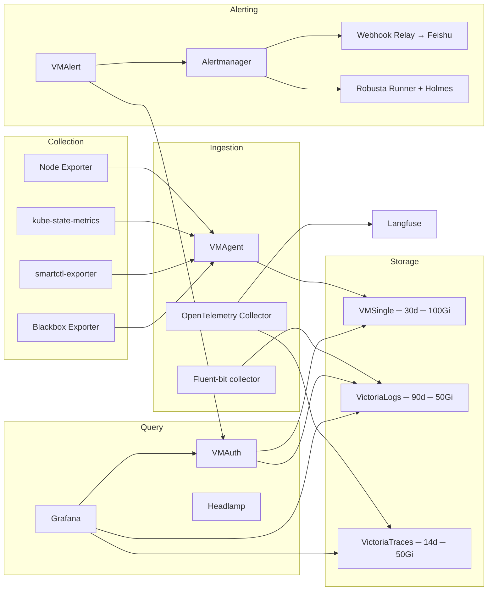

# Observability

The observability stack provides metrics, logs, traces, alerting, and cluster visibility across the homelab. All components are managed by Flux via OCIRepository HelmReleases in the `monitoring-system` namespace.

## Architecture overview



## VictoriaMetrics cluster

The metrics stack uses VictoriaMetrics deployed as the `victoria-metrics-k8s-stack` chart. Built-in Prometheus Operator, node-exporter, kube-state-metrics, and Grafana are disabled in favor of standalone deployments at controlled versions.

### VMSingle

Single-node time-series database with 30-day retention and 100Gi Ceph block storage (`ceph-block` StorageClass). Series cardinality is capped to protect Ceph: `storage.maxHourlySeries: 400000`, `storage.maxDailySeries: 1000000`. Internal endpoint: `vmsingle-victoria-metrics-cluster.monitoring-system.svc.cluster.local:8428`. UI exposed at `metrics.noirprime.com` (root path rewritten to `/vmui/`).

High-cardinality metric relabeling drops unnecessary histogram buckets and labels at scrape time (kube-apiserver request duration buckets, admission metrics, kubelet runtime/PLEG operation buckets). Container blkio metrics are preserved for per-pod IOPS panels.

### VMAgent

Scrapes PodMonitors, ServiceMonitors, Probes, and ScrapeConfigs cluster-wide. Configured with `promscrape.dropOriginalLabels: "true"` to reduce label cardinality. Internal endpoint: `vmagent-victoria-metrics-cluster.monitoring-system.svc.cluster.local:8429`.

**Custom ScrapeConfigs** extend scraping beyond the cluster boundary. The
Synology scrape jobs (`synology-snmp`, `synology-node`, `synology-smart`)
were removed: the NAS exporter compose stack was unmaintained and dead, and
NAS disk health is covered by Scrutiny on the host.

### VMAuth

Multi-tenant read proxy at `vmauth-victoria-metrics-cluster.monitoring-system.svc.cluster.local:8427`. Routes by path prefix:

| Path prefix | Upstream |
|-------------|----------|
| `/api/v1/query.*`, `/api/v1/label/.*` | VMSingle (8428) |
| `/select/logsql/.*` | VictoriaLogs server (9428) |

VMAuth is the single read endpoint used by VMAlert for both metrics and logs rule evaluation.

### VMAlert

Alerting rules engine with datasource pointed at VMAuth (`8427`). Internal endpoint: `vmalert-victoria-metrics-cluster.monitoring-system.svc.cluster.local:8080`.

**Metrics alert rules** (standard PromQL):

| Group | Alerts |
|-------|--------|
| `dockerhub.rules` | `DockerhubRateLimitRisk` — > 100 Docker Hub images active |
| `oom.rules` | `OOMKilled` — container restart with OOMKilled reason |
| `k8s.rules` | `HighContainerNonZeroExits` — > 5 non-zero exits in 15m |
| `smartctl-exporter.rules` | SMART temperature, test failure, critical warnings, media errors, available spare, interface speed |

**Logs alert rules** (LogsQL, `type: vlogs`):

| Group | Alerts |
|-------|--------|
| `vlogs.rules` | `HasErrorLog` — prod error/warn log count > 0 |
| `ServiceRequest` | `TooManyFailedRequest` — IPs with >1% failed requests |

### Alertmanager

Single Alertmanager instance at `vmalertmanager-victoria-metrics-cluster.monitoring-system.svc.cluster.local:9093`. UI at `alert.noirprime.com`.

**Routing**: alerts grouped by `alertname` and `job`. Group interval 10m, repeat 12h. Warning/critical alerts route to the `default` receiver. `InfoInhibitor`/`Watchdog` alerts are blackholed, and a second blackhole route drops chart-rendered ceph-mixin alerts (`type=ceph_default`) that are replaced by ceph-local-rules.

**Inhibition**: critical alerts suppress warning alerts for the same `alertname` + `namespace`.

**Delivery**: the `default` receiver fans out via `webhook_configs` to webhook-relay (Feishu, via apprise, with resolved-alert notifications) and in parallel to the robusta-runner (`/api/alerts`) for enrichment + Holmes RCA, which delivers through its own webhook sink. Credentials sourced from 1Password via ExternalSecret.

## VictoriaLogs

Single-node log storage using the `victoria-logs-single` chart. 90-day retention with 50Gi Ceph block storage. Server at `victoria-logs-server.monitoring-system.svc.cluster.local:9428`. UI at `logs.noirprime.com` (root rewritten to `/select/vmui/`). ServiceMonitor enabled for self-monitoring.

### Fluent-bit collector

The `victoria-logs-collector` chart deploys Fluent-bit as a DaemonSet (per-node log collection). Remote write target: `http://victoria-logs-server.monitoring-system.svc.cluster.local:9428` with 10GB per-URL disk buffer for resilience during server downtime.

Stream fields preserved: `kubernetes.pod_name`, `kubernetes.pod_namespace`, `kubernetes.container_name`, `kubernetes.pod_labels.app.kubernetes.io/name`. ANSI escape sequences stripped from `_msg` via `kubernetesCollector.decolorizeFields`.

Logs are queried through VMAuth (LogsQL endpoint), Grafana (VictoriaLogs datasource, traces-to-logs correlation), and directly for VMAlert vlogs-type rules.

## VictoriaTraces

Single-node trace storage using `victoria-traces-single` chart. 14-day retention with 50Gi Ceph block storage. Server at `victoria-traces.monitoring-system.svc.cluster.local:10428`. UI at `traces.noirprime.com` (root rewritten to `/select/vmui/`). ServiceMonitor enabled.

Grafana datasource configured as Jaeger type (`/select/jaeger`), with traces-to-logs correlation (`victoria-logs` datasource, ±1m window, matched on `service.name`), traces-to-metrics correlation (VictoriaMetrics datasource, ±2m window), node graph, and duration span bars.

## OpenTelemetry Collector

Deployed via the `opentelemetry-collector` Helm chart in **deployment** mode with **2 replicas**. Image: `otelcol-k8s` distribution with `GOMEMLIMIT` enabled.

### Receivers

| Protocol | Port | Transport |
|----------|------|-----------|
| OTLP gRPC | 4317 | TCP, `appProtocol: grpc` |
| OTLP HTTP | 4318 | TCP |
| Prometheus (self) | 8888 | Pull-based metrics export |

Jaeger, Zipkin, and legacy receivers disabled.

### Processors

| Processor | Pipeline(s) | Purpose |
|-----------|-------------|---------|
| `memory_limiter` | All | Soft limit 80%, spike limit 25% |
| `k8sattributes` | `traces/app` | Kubernetes pod/namespace enrichment |
| `tail_sampling` | `traces/app` | Error traces always kept; latency >5s kept; 10% probabilistic baseline |
| `redaction/credentials` | `traces/servitor` | Blocks GitHub tokens, AWS keys, JWTs, 1Password refs, private keys, Bearer tokens |
| `filter/gen_ai` | `traces/servitor` | Drops spans with `gen_ai.system` attribute set |
| `batch` | All | 1024 batch, 2048 max, 1s timeout |

### Dual export

Two independent trace pipelines share the same OTLP receiver input:

1. **`traces/app`** — application traces flow through memory limiter → k8s attributes → tail sampling (5% effective for normal traces) → batch → **VictoriaTraces** (`/insert/opentelemetry/v1/traces`)
2. **`traces/servitor`** — servitor (LLM agent) traces flow through memory limiter → credential redaction → gen_ai filter → batch → **Langfuse** (`/api/public/otel`)

Both exporters use queued retry with 10 consumers, 5000 queue depth, and exponential backoff (5s initial, 30s max, 300s elapsed).

## Grafana

Grafana is managed by the **Grafana Operator** (`grafana-operator` Helm chart, 1 replica), not via the Helm chart directly. The `Grafana` CR declares the full deployment spec: 2 replicas with `topologySpreadConstraints` (hostname skew). PostgreSQL-backed (CNPG `postgres-rw.database-system`), `postgres-init` init container with the `grafana-pguser` secret for automatic database provisioning.

### Authentication

Authentik OIDC SSO with auto-login and disabled login form. Role mapping via `role_attribute_path`: `homelab-admin` group members get `GrafanaAdmin`; everyone else gets `Viewer`. Admin credentials and OIDC client secret sourced from 1Password via ExternalSecret (`admin-user`, `admin-password`, `oidc_client_id`, `oidc_client_secret`). Endpoint: `grafana.noirprime.com`.

### Datasources

| Datasource | Type | Endpoint | Default |
|-----------|------|----------|---------|
| `victoria-metrics` | `victoriametrics-metrics-datasource` | VMSingle:8428 | Yes |
| `victoria-logs` | `victoriametrics-logs-datasource` | VictoriaLogs server:9428 | No |
| `victoria-traces` | `jaeger` | VictoriaTraces:10428 | No |
| `alertmanager` | `alertmanager` | VMAlertmanager:9093 | No |

VictoriaTraces datasource includes traces-to-logs and traces-to-metrics correlation configuration.

### Preinstalled plugins

`grafana-clock-panel`, `victoriametrics-metrics-datasource`, `victoriametrics-logs-datasource`.

### Dashboards

Dashboards are vendir-synced from upstream sources into `_sources/` and converted to ConfigMaps via `configMapGenerator` in kustomize. The Grafana Operator picks them up via `GrafanaDashboard` CRs. Repo-owned custom boards live in `custom/` (not vendored).

The set is **debug-focused** (2026-09 audit): current state belongs to native UIs (headlamp, ceph-mgr dashboard, hubble-ui, agentgateway `:15000/ui`, VM UIs at metrics/logs/traces/alert.noirprime.com) and failures are pushed by vmalert rules; Grafana keeps only trend/correlation boards nothing else provides. Dropped boards (dead datasources, duplicated by native UIs, or duplicated envoy views) stay commented in `vendir.yml` for re-import.

| Folder | Boards |
|--------|--------|
| Default (must-check, alert-silent) | k8s-system-api-server, blackbox-exporter, envoy-proxy-global, **kopiur-slo** (custom), **basement-health** (custom) |
| Kubernetes | k8s-views global / namespaces / nodes / pods |
| Storage | ceph-cluster, ceph-osd, ceph-pools |
| Network | kgateway, cilium-agent |
| Databases | cnpg, dragonfly |
| Nodes | node-exporter-full, smartctl-exporter |

`custom/` holds two repo-owned boards. `kopiur-slo.json` replaces the vendored kopiur board, whose queries referenced metric families the operator does not emit; it tracks backup staleness, failures, size/duration, and repository health from the live `kopiur_*` families. `basement-health.json` is the failure-revealing board: SLO budgets first, fires second, weak signals last, with 3-line runbooks per panel (app-plane excluded — alerts cover it).

## Host, cluster, and disk metrics

### Node Exporter

Standalone `node-exporter` Helm chart — *not* the bundled one from the VictoriaMetrics stack. Ignores container/virtual filesystems and mountpoints under `/var/lib/kubelet/pods`. Instance label rewritten to `NODE.homelab.internal:9100` for consistency. Resources: 23m CPU request, 64Mi memory limit.

### kube-state-metrics

Standalone `kube-state-metrics` chart with Flux CRD support. Drops high-cardinality metrics (`kube_pod_container_status_waiting_reason`, `kube_pod_container_status_terminated_reason`) and init container status variants. Custom `customResourceState` config exports `gotk_resource_info` metrics for Flux Kustomization, HelmRelease, GitRepository, OCIRepository, HelmRepository, HelmChart, and Bucket resources. RBAC extended for `source.toolkit.fluxcd.io`, `kustomize.toolkit.fluxcd.io`, `helm.toolkit.fluxcd.io`, and `notification.toolkit.fluxcd.io`.

### smartctl-exporter

Per-node DaemonSet exposing S.M.A.R.T. disk health metrics from NVMe and SATA drives. ServiceMonitor with instance label rewritten to `NODE.homelab.internal`. Custom PrometheusRules for temperature (>65°C), SMART test failure, critical warnings, media errors, available spare below threshold, and interface speed mismatch.

## Blackbox Exporter

`blackbox-exporter` chart with `http_2xx`, `icmp`, and `tcp_connect` modules (all IPv4-preferred, 5s timeout) plus a `studio_api` module (10s timeout, bearer token from the `studio-api-auth` ExternalSecret) for the MacStudio oMLX API plane. ServiceMonitor scrapes at 1m interval. `NET_RAW` capability for ICMP probes. Alert rules: `BlackboxProbeFailed` fires after 15m of probe failure; `MacStudioApiDown` covers the studio probe with a faster 5m trigger. Per-model inference probes (embedding/rerank) are deliberately absent — inference calls would force oMLX model reloads and flap on evictions.

### Probe targets

| Probe | Module | Targets |
|-------|--------|---------|
| `devices` | `icmp` | esxi, nas, unifi (all `.homelab.internal`; zigbee commented out — device offline) |
| `nfs` | `tcp_connect` | `nas.homelab.internal:2049` |
| `studio-models` | `studio_api` | `studio.homelab.internal:8000/v1/models` — oMLX model-plane health (30s interval) |

## Silence Operator

`silence-operator` chart pointed at Alertmanager (`vmalertmanager-victoria-metrics-cluster.monitoring-system.svc.cluster.local:9093`). Silences are declared as CRs (`Silence` kind) and kept in-cluster — no network policy enforcement.

**Active silences**:

| Silence | Matchers | Reason |
|---------|----------|--------|
| `vm-health-too-many-logs` | `TooManyLogs` | Chart-default threshold-0 rule: any warn log in the VM stack fires |
| `vm-health-too-many-scrape-errors` | `TooManyScrapeErrors` | Threshold-0 rule: a single failed scrape in 15m fires; `TargetDown` covers real outages |
| `macstudio-offline` | `MacStudioApiDown` | Mac Studio offline (owner decision); remove when the box is back |

## Headlamp

Headlamp K8s web UI deployed with 1 replica at `headlamp.noirprime.com`. Uses a read-only `view` ClusterRole (aggregated, excludes secrets) extended with Flux CRD read access (`headlamp-flux-view` aggregated ClusterRole). Kubeconfig generated at init via SA token. OIDC SSO via Authentik (client credentials from ExternalSecret). Flux plugin (`headlamp-plugin-flux`) copied at init.

## Langfuse

LLM observability platform for tracing servitor (agent) interactions. Two components, both using `app-template` chart:

| Component | Image | Resources |
|-----------|-------|-----------|
| `langfuse-web` | `ghcr.io/langfuse/langfuse` | 1 CPU request, 2Gi memory limit |
| `langfuse-worker` | `ghcr.io/langfuse/langfuse-worker` | 2 CPU request, 4Gi memory limit |

### Storage backends

| Backend | Technology | Purpose |
|---------|-----------|---------|
| Metadata DB | CNPG (PostgreSQL) | Langfuse schema via `postgres-init` init container |
| Analytics DB | ClickHouse `default-clickhouse.database-system:9000` | Trace/token analytics, `langfuse` database |
| Cache/Queue | Dragonfly `langfuse-dragonfly.monitoring-system:6379` | Redis-compatible, TLS disabled |
| Object store | Ceph RGW (S3) `langfuse` bucket | Event uploads (`events/`), media uploads (`media/`), batch exports disabled |

Web component exposed at `langfuse.noirprime.com`. Telemetry disabled. Experimental features enabled.

### Traces ingestion

OTel Collector routes servitor traces to Langfuse's OTLP endpoint (`langfuse-web:3000/api/public/otel`) after credential redaction and gen_ai span filtering. See [OpenTelemetry Collector](#opentelemetry-collector) for pipeline details.

## Robusta

Robusta (runner + embedded Holmes) receives a parallel fan-out of every alert from Alertmanager for enrichment and AI root-cause analysis (agentgateway LLM lane, `robusta-holmes` service). Findings are delivered to Feishu via the webhook-relay `robusta` route, and warning-or-higher findings also land as tickets in the Forgejo `homelab-tickets` repo via the same relay's HTTP target. The Robusta SaaS sink is disabled.

**Tickets**: `tickets-relay` posts findings to the relay's `robusta-tickets` route, which gates Alertmanager-sourced (`source == "PROMETHEUS"`) MEDIUM/HIGH findings into a local ticket consumer on `127.0.0.1:8082`. Robusta's builtin OOM/CrashLoop/ImagePull/Evicted playbooks emit separate `KUBERNETES_API_SERVER` findings for events the `OOMKilled`/`KubePodCrashLooping` rules already cover; those reach Feishu only, so one incident yields one ticket. `globalConfig.custom_severity_map` maps `warning` to `medium`, which Robusta resolves to HIGH (its default maps warning to LOW, which would drop most rules); `info`/`none` stay below the gate. The tickets sink's `size_limit` is raised from 4096 to 256 KiB so enrichments are not truncated away. The relay ingress CNP restricts callers by pod identity and HTTP path. One consumer, one replica, and `Recreate` updates serialize Forgejo writes.

Incident identity is source + alert name + scope (namespace/workload/node/container labels, Deployment pod hashes stripped), so a rollout's new pods and a rule-error storm across many rule groups (`AlertingRulesError` carries one series per group) share one ticket. An occurrence marker (instance fingerprint + firing/resolved + `starts_at`/`ends_at`) suppresses Alertmanager re-notifications, whose Robusta id, timestamp and enrichments change every time, while concurrent instances still resolve independently. Lookup uses the Forgejo issue-search index as a hint (verified against the leading marker), so known incidents cost one request; a miss (new incident or index lag) falls back to a full scan, so the index can never cause a duplicate. A new failure reopens a closed incident; replaying an old event does not undo a human close. Resolution never auto-closes a ticket, and an unmatched resolution does not create one.

**Holmes investigation**: on create, and on reopen at most once per 6h, the consumer queues one Holmes `/api/chat` request (`HOLMES_URL`, off the delivery lock, 10 min timeout) and posts the answer as a ticket comment. Holmes 0.42 has no `/api/investigate`, so Robusta's `ask_holmes` action cannot be used. The queue is in memory; a restart loses pending investigations, never tickets.

**Delivery monitoring**: vmagent scrapes chaski's `:8081/metrics` (ServiceMonitor + CNP). `TicketDeliveryFailing` fires on any non-success `chaski_target_sends_total{target="forgejo-tickets"}`; `TicketRelayMetricsAbsent` fires when the scrape itself is missing.

The consumer alone receives `forgejo.pat_tickets`; chaski receives only its Feishu credential. That existing PAT is allowlisted for `homelab-tickets` and has issue/repository write scopes, also used by the manual lessons workflow. Forgejo MCP reuses it behind a server-side allowlist: ticket writes and repository reads only, no file/workflow changes or action dispatch. NAS HTTP remains an explicitly accepted LAN transport risk. The fixer claims by comment, proposes a GitHub PR, and closes only after human merge and evidence-based verification; this is not an automatic fix/heal loop. Operator procedure: `.omp/skills/homelab-tickets/SKILL.md`.

**Pod DELETE audit history**: the OTel Collector watches `events.k8s.io` `PolicyViolation` events and exports them to persistent VictoriaLogs, using the event note as `_msg`. A pre-created, narrowly scoped lease makes only one of the two collectors watch at a time. Event UID, event/series timestamps, actor and policy message survive deletion of the Pod/PolicyReport. Initial-state recovery can replay events: compare UID and series state, not raw delivery counts. Events expire in Kubernetes and the exporter queue is in memory; outages beyond event TTL or queue/retry limits can lose evidence. This is not a complete Kubernetes API audit trail. See `infrastructure/forgejo/skills/acceptance.md` for the observation-window gate.

Holmes also runs on a schedule via `ScheduledHealthCheck` CRs. Results stay in CR status; kube-state-metrics exports `holmes_scheduledhealthcheck_last_result` and `HolmesHealthCheckFailed` (warning) alerts on `fail`/`error`, which then flows into tickets like any other warning:

| Check | Schedule | Scope |
|-------|----------|-------|
| `ceph-health-growth` | every 6h | Ceph health, OSD/pool usage trends |
| `cert-expiry-watch` | daily | cert-manager certs expiring < 14d or not Ready |
| `node-density-trend` | daily | per-node pod density and request saturation |
| `alert-rule-quality-weekly` | weekly | top firing/flapping rules, proposed adjustments |
| `backup-chain-daily` | daily | kopiur + CNPG backup runs and snapshot age |

## Alert routing

```
VMAlert rules (PromQL + LogsQL)
  │
  ▼
VMAuth (read proxy for VMSingle + VictoriaLogs)
  │
  ▼
Alertmanager ──► blackhole (InfoInhibitor, Watchdog, chart-rendered ceph-mixin)
  │
  ▼
default receiver (webhook_configs)
  ├──► webhook-relay → Feishu (chat notifications, sendResolved: true)
  └──► robusta-runner → enrichment + Holmes RCA → Feishu via webhook sink
```

Alertmanager groups alerts by `alertname` + `job`, waits 1m before first notification, and repeats every 12h — every 2h for `severity=critical`, so an unhandled critical keeps paging. Credentials (Feishu webhook token) from 1Password via ExternalSecret.

## External observation

No out-of-cluster observation surface exists and none is planned. Alert delivery is Feishu-only via Alertmanager → webhook-relay; a total cluster or WAN outage surfaces as the absence of alerts (silence = incident).
