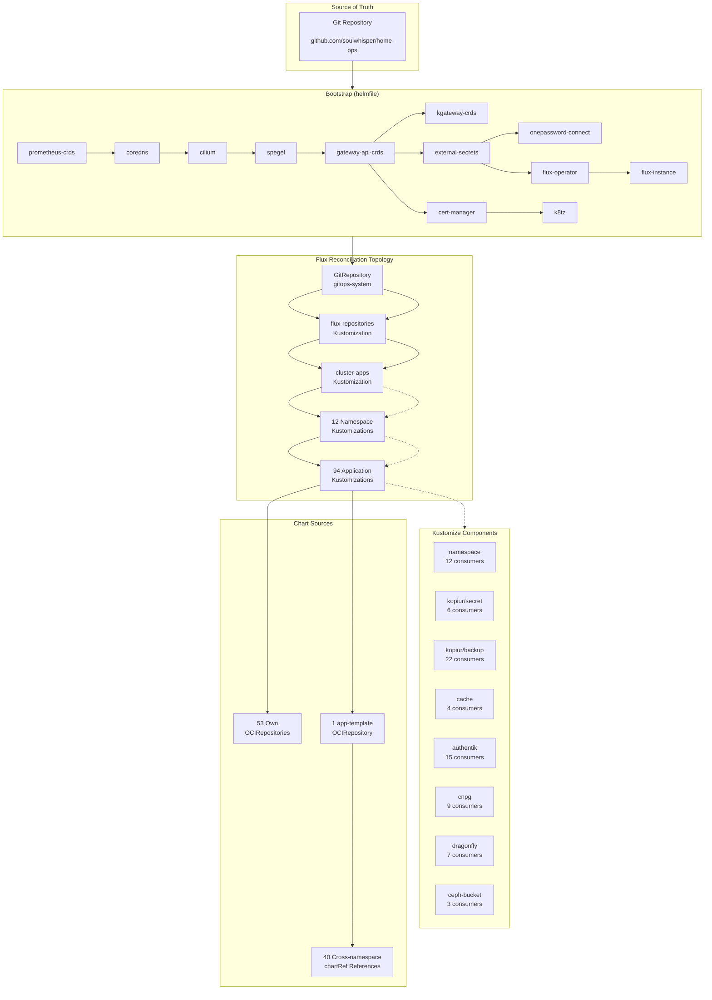

# Cluster Architecture

## Overview

The home-ops Kubernetes cluster runs on Talos Linux, managed entirely through GitOps with Flux CD. Every resource — from cluster-wide operators to individual applications — is declared in this repository and reconciled automatically. The architecture is built around four design principles:

1. **Git as the single source of truth** — No `kubectl apply` or manual Helm installs. Everything flows through Flux.
2. **Composability through Kustomize** — Eight reusable Kustomize Components encode cross-cutting concerns so individual applications stay lean.
3. **OCI-first chart sourcing** — All Helm charts are pulled from OCI registries; legacy `HelmRepository` resources are eliminated entirely.
4. **Layered patching** — Three strategic patch layers inject defaults at the cluster level, eliminating boilerplate from every application definition.



## Flux Topology

The reconciliation chain follows a strict hierarchy: one `GitRepository` feeds two cluster-level `Kustomization` resources, which recursively discover and reconcile every application in the tree.

### GitRepository → Cluster Kustomizations

A single `GitRepository` named `gitops-system` watches the `main` branch of `github.com/soulwhisper/home-ops`. It is declared by the `flux-instance` HelmRelease at bootstrap time (`kubernetes/apps/gitops-system/flux-instance/app/helmrelease.yaml`):

```yaml
sync:
  kind: GitRepository
  url: https://github.com/soulwhisper/home-ops.git
  ref: refs/heads/main
  path: kubernetes/flux/cluster
```

The cluster-level `Kustomization` resources live in `kubernetes/flux/cluster/cluster.yaml` and form a two-stage pipeline:

| Kustomization       | Path                             | Depends On          | Purpose                                                |
| ------------------- | -------------------------------- | ------------------- | ------------------------------------------------------ |
| `flux-repositories` | `./kubernetes/flux/repositories` | _(none)_            | Registers shared OCI chart sources                     |
| `cluster-apps`      | `./kubernetes/apps`              | `flux-repositories` | Recursively reconciles all namespaces and applications |

### Recursive Discovery

`cluster-apps` scans `kubernetes/apps/` recursively. Flux discovers each namespace's top-level `kustomization.yaml`, which references individual application `ks.yaml` files. This yields **12 namespace Kustomizations** and **94 application Kustomizations** (`ks.yaml` leaves).

Each application `ks.yaml` is a leaf `Kustomization` that points to its `app/` subdirectory containing the `HelmRelease`, `OCIRepository`, and any supplementary resources (ConfigMaps, Secrets, etc.).

### Flux Controller Tuning

The Flux controllers are tuned for a 3-node cluster (`kubernetes/apps/gitops-system/flux-instance/app/helmrelease.yaml`):

- **Concurrency**: `--concurrent=10` on kustomize, helm, and source controllers
- **Dependency requeue**: `--requeue-dependency=5s` for fast dependency resolution
- **Memory limits**: 2 GiB per controller
- **In-memory builds**: Kustomize builds use `emptyDir` backed by `Memory` medium
- **Helm caching**: 10-max cache with 60m TTL and 5m purge interval
- **OOM watch**: 95% threshold with 500ms check interval
- **Cancel health checks**: `CancelHealthCheckOnNewRevision=true` prevents stale health checks from blocking new revisions
- **Chart digest tracking**: Disabled via `DisableChartDigestTracking=true`

## Strategic Patching System

The `cluster-apps` Kustomization applies three strategic patches to every child `Kustomization` in the tree. These are defined in `kubernetes/flux/cluster/cluster.yaml` and eliminate boilerplate from all 94 application definitions.

### Layer 1: Kustomization Defaults (managed annotation)

**Target**: Any `Kustomization` with annotation `config.home-ops.io/managed=true`

Every application `ks.yaml` carries this annotation. The patch injects:

```yaml
spec:
  interval: 1h
  timeout: 5m
  sourceRef:
    kind: GitRepository
    name: gitops-system
    namespace: gitops-system
  prune: true
  wait: false
```

This means individual `ks.yaml` files never need to declare their `sourceRef`, `prune` behavior, or reconciliation interval — they only specify what varies: `targetNamespace`, `path`, `dependsOn`, `components`, and `postBuild`.

### Layer 2: Baseline Infrastructure Dependencies (deps label)

**Target**: Any `Kustomization` with label `config.home-ops.io/deps=infra`

Applications that require the foundational infrastructure layer (most user-facing workloads) carry this label. The patch injects a `dependsOn` block ensuring these four components are healthy before reconciliation begins:

```yaml
spec:
  dependsOn:
    - name: cert-manager
      namespace: security-system
    - name: onepassword-connect
      namespace: security-system
    - name: rook-ceph-cluster
      namespace: storage-system
    - name: kopiur
      namespace: storage-system
```

Applications can append additional app-specific dependencies in their own `ks.yaml` — Flux merges the lists. For example, `moviepilot` adds `cnpg-cluster`, `dragonfly-operator`, and `media-nfs` on top of the baseline (`kubernetes/apps/media-apps/moviepilot/ks.yaml:L17-L23`).

### Layer 3: HelmRelease Defaults (all child Kustomizations)

**Target**: Every child `Kustomization` under `cluster-apps`

This patch injects a `patches` block into each application `Kustomization` that targets all `HelmRelease` resources within that app:

```yaml
spec:
  maxHistory: 1
  install:
    crds: CreateReplace
    strategy:
      name: RetryOnFailure
    remediation:
      retries: -1 # retry indefinitely until success
  rollback:
    cleanupOnFail: true
    recreate: true
  upgrade:
    cleanupOnFail: true
    crds: CreateReplace
    strategy:
      name: RemediateOnFailure
    remediation:
      remediateLastFailure: true
      retries: 3
  uninstall:
    keepHistory: false
```

Key behaviors this enforces cluster-wide:

- **CRD lifecycle**: CRDs are created and upgraded automatically (`CreateReplace`), eliminating manual CRD management.
- **Install resilience**: `RetryOnFailure` with unlimited retries (`-1`) ensures initial installs survive transient errors.
- **Upgrade safety**: `RemediateOnFailure` with 3 retries and automatic rollback (`cleanupOnFail`, `recreate`) contains bad upgrades.
- **History hygiene**: `maxHistory: 1` and `keepHistory: false` prevent Helm release history accumulation.

## OCI-First Strategy

All Helm charts are sourced from OCI registries. The legacy `HelmRepository` CRD is eliminated — every chart reference uses `OCIRepository` exclusively.

### Own OCIRepositories (53)

Each non-trivial application defines its own `OCIRepository` resource in its `app/` subdirectory alongside its `HelmRelease`. These 53 repositories pull charts directly from their publishers' OCI registries:

| Namespace         | Count | Example Charts                                                                                                                                                                                                                                        |
| ----------------- | ----- | ----------------------------------------------------------------------------------------------------------------------------------------------------------------------------------------------------------------------------------------------------- |
| kube-system       | 11    | cilium, coredns, spegel, frr-k8s, descheduler, reloader, metrics-server, k8tz, gateway-api-crds, intel-device-plugins (operator + GPU)                                                                                                                |
| security-system   | 5     | authentik, cert-manager, external-secrets, onepassword-connect, kyverno                                                                                                                                                                                        |
| storage-system    | 6     | rook-ceph (app + cluster + drivers), kopiur, snapshot-controller, csi-driver-nfs                                                                                                                                                     |
| database-system   | 4     | cloudnative-pg, plugin-barman-cloud, dragonfly-operator, clickhouse-operator                                                                                                                                                                          |
| networking-system | 5     | kgateway (app + CRDs), agentgateway (app + CRDs), externaldns                                                                                                                                                                                         |
| monitoring-system | 16    | victoria-metrics (operator + cluster + app), victoria-logs (app + collector), victoria-traces, grafana, kube-state-metrics, node-exporter, prometheus-crds, blackbox-exporter, smartctl-exporter, opentelemetry-collector, silence-operator, headlamp, robusta |
| gitops-system     | 3     | flux-operator, flux-instance, tuppr (system-upgrade-controller)                                                                                                                                                                                       |
| others            | 3     | toolhive (app + CRDs), netbox                                                                                                                                                                                                            |

The `OCIRepository` fetches only the chart layer via `layerSelector` with `operation: copy`, which extracts the Helm chart tarball from the OCI manifest without pulling unrelated layers.

### App-Template Pattern (40 Cross-Namespace References)

For applications that don't need a custom Helm chart, the **app-template** pattern is used. A single `OCIRepository` is defined in `kubernetes/flux/repositories/app-template.yaml`:

```yaml
apiVersion: source.toolkit.fluxcd.io/v1
kind: OCIRepository
metadata:
  name: app-template
  namespace: gitops-system
spec:
  interval: 10m
  layerSelector:
    mediaType: application/vnd.cncf.helm.chart.content.v1.tar+gzip
    operation: copy
  ref:
    tag: 5.2.1
  url: oci://ghcr.io/bjw-s-labs/helm/app-template
```

Applications reference this chart from any namespace using `chartRef` with an explicit namespace:

```yaml
spec:
  chartRef:
    kind: OCIRepository
    name: app-template
    namespace: gitops-system
```

This cross-namespace reference is used by 40 HelmReleases across 8 namespaces:

| Namespace         | Count | Example Apps                                                                                                                                                         |
| ----------------- | ----- | -------------------------------------------------------------------------------------------------------------------------------------------------------------------- |
| media-apps        | 8     | jellyfin, kavita, navidrome, qbittorrent, immich, moviepilot, metube, qbittorrent-ui                                                                                 |
| selfhosted-apps   | 13    | searxng, sillytavern, stirling-pdf, bambuddy, dispatcharr, karakeep, homepage, trendradar, hindsight, open-notebook (app + database), firecrawl (app + database) |
| smarthome-apps    | 7     | home-assistant (app + sgcc), frigate, frigate-vision, zigbee2mqtt, mosquitto, scrypted                                                                                               |
| servitor-apps     | 5     | hermes-agent, mattermost, open-webui (app + oikb + terminals)                                                                                                                         |
| gaming-apps       | 2     | crafty-controller, foundryvtt                                                                                                                                        |
| monitoring-system | 3     | langfuse (app + worker), webhook-relay                                                                                                                                              |
| networking-system | 1     | agentgateway MCP config                                                                                                                                              |
| database-system   | 1     | cnpg maintenance (dr-test cronjob)                                                                                                                                   |

The `flux-repositories` Kustomization is reconciled before `cluster-apps` (via `dependsOn`), ensuring the `app-template` `OCIRepository` is always available before any application HelmRelease references it.

## Kustomize Component System

Eight Kustomize Components encode cross-cutting concerns as reusable building blocks. Applications declare which components they need in their `ks.yaml` — the component injects all required resources automatically.

### Component: namespace (12 consumers)

**Path**: `kubernetes/components/namespace/`

Every top-level namespace Kustomization includes this component. It provides:

1. **Namespace resource** with label `kustomize.toolkit.fluxcd.io/prune: disabled` — prevents Flux from ever deleting the namespace, even when `prune: true` is set.
2. **Alert resources** — Flux `Alert` and `Provider` definitions that send notifications to the notification-controller for all Flux resources in the namespace.

```yaml
# kubernetes/components/namespace/labels.yaml
apiVersion: v1
kind: Namespace
metadata:
  name: _
  labels:
    kustomize.toolkit.fluxcd.io/prune: disabled
```

The `name: _` is a Kustomize placeholder — postBuild substitution in each namespace's `kustomization.yaml` fills in the actual namespace name.

### Component: kopiur/secret (6 consumers)

**Path**: `kubernetes/components/kopiur/secret/`

Included by namespace-level Kustomizations that host backed-up workloads. Injects a namespace-level `ExternalSecret` that pulls the kopia repository password and S3 access keys (NAS VersityGW) from 1Password into the `kopiur-repository-secret` Secret. The shared `ClusterRepository` itself lives with the kopiur app at `kubernetes/apps/storage-system/kopiur/repository/clusterrepository.yaml`.

### Component: kopiur/backup (22 consumers)

**Path**: `kubernetes/components/kopiur/backup/`

The most heavily used component. It provisions the backup-and-recovery pipeline for a stateful application:

| Resource                | Purpose                                                                                 |
| ----------------------- | --------------------------------------------------------------------------------------- |
| `PersistentVolumeClaim` | Creates the application's data PVC (claims the `Restore` populator via `dataSourceRef`) |
| `SnapshotPolicy`        | The backup recipe: CSI snapshot copy method, zstd-fastest, keep-daily 14                |
| `SnapshotSchedule`      | Cron invocation of the policy (every 6h, `KOPIUR_SCHEDULE` overridable)                 |
| `Restore`               | Passive volume populator: first boot restores the latest snapshot                       |

Applications that need persistent data backed up to S3 include this component. The PVC template is parameterized through `postBuild` substitution with the `APP` variable.

### Component: cache (4 consumers)

**Path**: `kubernetes/components/cache/`

Injects a rewarmable cache/scratch `PersistentVolumeClaim` on the replica=1 `ceph-cache` NVMe pool — no replication amplification, data loss on OSD failure is acceptable. Consumers mount it via `existingClaim`. Never use for durable data.

### Component: authentik (15 consumers)

**Path**: `kubernetes/components/authentik/`

Injects a `TrafficPolicy` resource that configures kgateway to require Authentik SSO authentication for the application's route. Applications behind the single sign-on gateway include this component.

The policy enforces:

- Forward auth via Authentik's outpost
- Unauthenticated requests redirected to the Authentik login flow
- Session validation on every request

### Component: cnpg (9 consumers)

**Path**: `kubernetes/components/cnpg/`

Injects an `ExternalSecret` that provisions a CloudNativePG database user secret from 1Password. Applications that need a PostgreSQL database (managed by the CloudNativePG operator) include this component.

The `ExternalSecret` references the 1Password item containing the database connection URI, username, and password, making them available as Kubernetes secrets for the application's pods.

### Component: dragonfly (7 consumers)

**Path**: `kubernetes/components/dragonfly/`

Injects Dragonfly database resources for applications using Dragonfly (a Redis-compatible drop-in):

| Resource     | Purpose                                                      |
| ------------ | ------------------------------------------------------------ |
| `Dragonfly`  | Declares a Dragonfly instance with the application's name    |
| `PodMonitor` | Configures Prometheus metrics scraping for the Dragonfly pod |

Applications with caching or session storage requirements include this component.

Optional Flux substitution variables:

- `REDIS_MEM` — memory request/limit (default `1024Mi`)
- `DRAGONFLY_LUA_FLAGS` — value for `--default_lua_flags` (default empty). Set
  `allow-undeclared-keys,disable-atomicity` for BullMQ-based apps (e.g. `langfuse`).

### Component: ceph-bucket (3 consumers)

**Path**: `kubernetes/components/ceph-bucket/`

Injects an `ObjectBucketClaim` that provisions an S3-compatible bucket from the Rook-Ceph object store. Used by `langfuse`, `mattermost`, and `open-webui`.

### Component Composition

Applications frequently stack multiple components. For example, `moviepilot` (`kubernetes/apps/media-apps/moviepilot/ks.yaml`) uses three:

```yaml
components:
  - ../../../../components/cnpg # PostgreSQL database
  - ../../../../components/dragonfly # Redis cache
  - ../../../../components/kopiur/backup # PVC backup to S3
```

The only four-component stack is `open-webui` (`authentik`, `cnpg`, `dragonfly`, `ceph-bucket`). `netbox` uses `cnpg`, `dragonfly`, and `kopiur/backup`; `langfuse` uses `cnpg`, `dragonfly`, and `ceph-bucket`.

## Namespace Inventory

The cluster uses 12 namespaces, ordered by dependency from foundational infrastructure to end-user applications:

| #   | Namespace           | Purpose                              | Key Resources                                                                                                                                                                                                                              |
| --- | ------------------- | ------------------------------------ | ------------------------------------------------------------------------------------------------------------------------------------------------------------------------------------------------------------------------------------------ |
| 1   | `kube-system`       | Cluster networking and node services | Cilium CNI, CoreDNS, Spegel mirror, FRR-K8s BGP, Intel GPU plugins, Reloader, Descheduler, k8tz, Gateway API CRDs, Metrics Server                                                                                         |
| 2   | `security-system`   | Identity, certificates, secrets      | Authentik SSO, cert-manager, External Secrets Operator, 1Password Connect, Kyverno (6 ClusterPolicies)                                                                                                                                                                  |
| 3   | `storage-system`    | Persistent storage and backups       | Rook-Ceph (block + object), CSI NFS driver, kopiur, Snapshot Controller                                                                                                                                                   |
| 4   | `database-system`   | Database operators                   | CloudNativePG, Dragonfly Operator, ClickHouse Operator                                                                                                                                                                                     |
| 5   | `networking-system` | Ingress, DNS, API gateway            | kgateway (Envoy Gateway), Agent Gateway (AI agent routing), ExternalDNS                                                                                                                                                                    |
| 6   | `monitoring-system` | Observability                        | Victoria Metrics (operator + cluster), Victoria Logs, Victoria Traces, Grafana, Prometheus CRDs, kube-state-metrics, node-exporter, blackbox-exporter, Smartctl exporter, OTel Collector, Silence Operator, Langfuse, Robusta, webhook-relay, Headlamp |
| 7   | `servitor-apps`     | AI and development tooling           | Hermes Agent, Toolhive, MCP server fleet (14 servers), Mattermost, Open-WebUI                                                                                                                                                                                                        |
| 8   | `smarthome-apps`    | Home automation                      | Home Assistant (app + SGCC), Frigate NVR (+ frigate-vision), Zigbee2MQTT, Mosquitto MQTT, Scrypted, smarthome-nfs                                                                                                                                                            |
| 9   | `media-apps`        | Media serving and management         | Jellyfin, Kavita, Navidrome, qBittorrent (+ qbittorrent-ui), Immich, MoviePilot, MeTube, media-nfs                                                                                                                                                                       |
| 10  | `selfhosted-apps`   | Self-hosted web services             | SearXNG, NetBox, Stirling PDF, SillyTavern, Karakeep, Homepage, Hindsight, Dispatcharr, BambuBuddy, trendradar, Open Notebook, Firecrawl                                                                                                 |
| 11  | `gaming-apps`       | Game servers                         | Crafty Controller (Minecraft), Foundry VTT                                                                                                                                                                                                 |
| 12  | `gitops-system`     | Flux itself                          | Flux Operator, Flux Instance, System Upgrade Controller                                                                                                                                                                                    |

### Dependency Order

The namespace numbering reflects the reconciliation dependency chain:

1. **kube-system** must be ready first — networking, DNS, and node services are prerequisites for everything else.
2. **security-system** provides TLS certificates and secret management that all upper layers consume.
3. **storage-system** provisions PVCs, snapshots, and S3 buckets that stateful applications depend on.
4. **database-system** runs the operators that create databases for applications.
5. **networking-system** configures ingress routes and DNS records for externally accessible services.
6. **monitoring-system** scrapes metrics and collects logs from all other namespaces.
   7-11. **Application namespaces** depend on layers 1-6 being operational.
12. **gitops-system** runs Flux itself — bootstrapped externally, then self-managed.

## Bootstrap Chain

Before Flux can manage the cluster, the foundational components must be installed. This is handled by a **helmfile** in `kubernetes/bootstrap/helmfile.yaml` — 12 releases wired into a dependency DAG via `needs:`:

```
prometheus-crds → coredns → cilium → spegel → gateway-api-crds
gateway-api-crds → kgateway-crds
                 → external-secrets → onepassword-connect
                 → cert-manager → k8tz
external-secrets → flux-operator → flux-instance
```

### Why helmfile?

Flux cannot install itself. The bootstrap chain uses helmfile for the initial provisioning because:

1. Talos clusters start with no cluster services — not even a CNI.
2. CoreDNS is installed before Cilium (hubble-relay rendering requires cluster DNS to exist; it only becomes ready once Cilium provides pod networking).
3. Spegel provides the OCI registry mirror that subsequent chart pulls use.
4. Gateway API CRDs are needed by kgateway-crds, external-secrets, and cert-manager.
5. External Secrets and 1Password Connect provision the secrets that Flux and applications consume; cert-manager and k8tz cover certificates and time-zone injection.
6. Flux Operator and Flux Instance are the last step — once they're running, Flux takes over.

### Step Details

| Step                  | Chart                                                                | Values Source        | Purpose                                                                                               |
| --------------------- | -------------------------------------------------------------------- | -------------------- | ----------------------------------------------------------------------------------------------------- |
| 1. `prometheus-crds`  | `oci://ghcr.io/prometheus-community/charts/prometheus-operator-crds` | _(none)_             | Installs Prometheus Operator CRDs (ServiceMonitor, PodMonitor, etc.) before Victoria Metrics operator |
| 2. `coredns`          | `oci://ghcr.io/coredns/charts/coredns`                               | `values.yaml.gotmpl` | Cluster DNS — must exist before Cilium renders hubble-relay (`wait: false` until the CNI is up)       |
| 3. `cilium`           | `oci://quay.io/cilium/charts/cilium`                                 | `values.yaml.gotmpl` | eBPF-based CNI with Gateway API, BGP, and network policy support                                      |
| 4. `spegel`           | `oci://ghcr.io/spegel-org/helm-charts/spegel`                        | `values.yaml.gotmpl` | Stateless OCI registry mirror using P2P image distribution                                            |
| 5. `gateway-api-crds` | `oci://ghcr.io/wiremind/wiremind-helm-charts/gateway-api-crds`       | _(none)_             | Gateway API CRDs (GatewayClass, Gateway, HTTPRoute, etc.)                                             |
| 6. `kgateway-crds`    | `oci://ghcr.io/kgateway-dev/charts/kgateway-crds`                    | _(none)_             | kgateway CRDs (gateways themselves installed later by Flux)                                       |
| 7. `external-secrets` | `oci://ghcr.io/external-secrets/charts/external-secrets`             | `values.yaml.gotmpl` | Kubernetes External Secrets Operator — syncs secrets from 1Password                                   |
| 8. `cert-manager`     | `oci://quay.io/jetstack/charts/cert-manager`                         | `values.yaml.gotmpl` | Certificate management for cluster-wide TLS                                                           |
| 9. `onepassword-connect` | `oci://ghcr.io/1password/connect`                                 | `values.yaml.gotmpl` | 1Password Connect server backing the ClusterSecretStore                                               |
| 10. `k8tz`            | `oci://ghcr.io/k8tz/k8tz/charts/k8tz`                                | `values.yaml.gotmpl` | Timezone injection via admission webhook (needs cert-manager)                                         |
| 11. `flux-operator`   | `oci://ghcr.io/controlplaneio-fluxcd/charts/flux-operator`           | `values.yaml.gotmpl` | Manages Flux Instance lifecycle                                                                       |
| 12. `flux-instance`   | `oci://ghcr.io/controlplaneio-fluxcd/charts/flux-instance`           | `values.yaml.gotmpl` | Creates the GitRepository and Kustomization resources that begin GitOps reconciliation                |

### Values Templating

The `values.yaml.gotmpl` file uses a clever pattern: it reads the Flux-managed `helmrelease.yaml` from the corresponding app directory and extracts the `spec.values` block:

```gotmpl
{{ (fromYaml (readFile (printf "../apps/%s/%s/app/helmrelease.yaml" .Release.Namespace .Release.Name))).spec.values | toYaml }}
```

This means the helmfile bootstrap and the Flux HelmRelease use the **exact same values** — the helmfile just reads them from the same file that Flux will later reconcile. No duplication, no drift.

### Bootstrap Secret

Before running the helmfile, a `1Password Connect` secret must be created manually in the `security-system` namespace. The template is in `kubernetes/bootstrap/resources.yaml.j2`:

```yaml
apiVersion: v1
kind: Secret
metadata:
  name: onepassword-connect
  namespace: security-system
stringData:
  1password-credentials.json: op://DevOps/1password-api/credentials
  token: op://DevOps/1password-api/token
```

This secret is referenced by the external-secrets Operator to authenticate with 1Password Connect and provision all other secrets in the cluster.

## Dependency Injection Label System

Two custom labels and an annotation drive the strategic patching and component injection system:

### `config.home-ops.io/managed: "true"`

**Type**: Annotation
**Purpose**: Opts a `Kustomization` into Layer 1 strategic patching (Kustomization defaults).
**Scope**: Every application `ks.yaml` (94 files).

Without this annotation, a Kustomization would not receive the automatic `sourceRef`, `prune`, `interval`, and `timeout` defaults. Infrastructure-only Kustomizations (like `flux-repositories`) omit it intentionally.

### `config.home-ops.io/deps: "infra"`

**Type**: Label
**Purpose**: Opts a `Kustomization` into Layer 2 strategic patching (baseline infrastructure dependencies).
**Scope**: Applications that need TLS certificates, secrets, storage, and backups before starting (54 `ks.yaml` files).

This label signals "I'm a workload that needs the core infra layer." Infrastructure components themselves (e.g., cert-manager, rook-ceph, cnpg-operator) omit this label — they _are_ the infra, so they only carry `managed: "true"`.

### Combined Effect

A typical application `ks.yaml` with both markers receives:

1. **From Layer 1** (`managed` annotation): `sourceRef`, `prune: true`, `interval: 1h`, `timeout: 5m`
2. **From Layer 2** (`deps=infra` label): baseline `dependsOn` (cert-manager, onepassword-connect, rook-ceph-cluster, kopiur)
3. **From Layer 3** (automatic): HelmRelease defaults (CRD management, retry, remediation, rollback)

The application's own `ks.yaml` only specifies what's unique: `targetNamespace`, `path`, app-specific `dependsOn`, `components`, and `postBuild` substitution.

## Directory Structure

```
kubernetes/
├── apps/                          # All application definitions
│   ├── kube-system/               #  1. Cluster networking and node services
│   │   ├── kustomization.yaml     #     Namespace Kustomization
│   │   └── <app>/                 #     Per-application directory
│   │       ├── ks.yaml            #       Flux Kustomization entrypoint
│   │       └── app/               #       HelmRelease + OCIRepository + resources
│   │           ├── helmrelease.yaml
│   │           ├── ocirepository.yaml
│   │           └── kustomization.yaml
│   ├── security-system/           #  2. Identity, certificates, secrets
│   ├── storage-system/            #  3. Persistent storage and backups
│   ├── database-system/           #  4. Database operators
│   ├── networking-system/         #  5. Ingress, DNS, API gateway
│   ├── monitoring-system/         #  6. Observability stack
│   ├── servitor-apps/             #  7. AI and development tooling
│   ├── smarthome-apps/            #  8. Home automation
│   ├── media-apps/                #  9. Media serving
│   ├── selfhosted-apps/           # 10. Self-hosted web services
│   ├── gaming-apps/               # 11. Game servers
│   └── gitops-system/             # 12. Flux itself
├── bootstrap/                     # Pre-Flux cluster provisioning
│   ├── helmfile.yaml              #   12-release bootstrap DAG
│   ├── resources.yaml.j2          #   1Password Connect secret template
│   └── values.yaml.gotmpl         #   Values bridge to Flux HelmReleases
├── components/                    # Reusable Kustomize Components
│   ├── namespace/                 #   Namespace + alerts (12 consumers)
│   ├── kopiur/secret/             #   Namespace-level kopia repo credentials (6 consumers)
│   ├── kopiur/backup/             #   PVC backup pipeline (22 consumers)
│   ├── cache/                     #   Rewarmable cache PVC on ceph-cache (4 consumers)
│   ├── authentik/                 #   SSO traffic policy (15 consumers)
│   ├── cnpg/                      #   PostgreSQL secret (9 consumers)
│   ├── dragonfly/                 #   Redis-compatible cache (7 consumers)
│   └── ceph-bucket/               #   S3 object bucket (3 consumers)
└── flux/                          # Flux cluster configuration
    ├── cluster/
    │   └── cluster.yaml           #   flux-repositories + cluster-apps Kustomizations
    └── repositories/
        ├── kustomization.yaml     #   Shared OCI source registration
        └── app-template.yaml      #   bjw-s app-template OCIRepository
```

## Talos Integration

The cluster runs on Talos Linux, a minimal, API-driven Kubernetes OS. Talos configuration lives in `infrastructure/talos/` and is not managed by Flux — node configuration is applied declaratively via `talosctl apply-config`.

Talos provides:

- **Immutable root filesystem** — no package manager, no SSH, no shell access on nodes
- **API-driven management** — all configuration changes flow through the Talos API
- **Automatic upgrades** — System Upgrade Controller (managed by Flux in `gitops-system`) handles Talos version upgrades via `talosctl upgrade-k8s` plans
- **NVMe storage** — M.2 NVMe SSDs across all nodes provide high-performance local storage for Rook-Ceph

The cluster uses Cilium as the CNI in native routing mode (no overlay), leveraging Talos's default network configuration and BGP peering via FRR-K8s for LoadBalancer service IP advertisement.

## Renovate Integration

[Renovate](https://github.com/renovatebot/renovate) monitors the repository for dependency updates across all layers:

- **Helm chart versions** in `helmrelease.yaml` files
- **OCIRepository tags** in `ocirepository.yaml` files
- **Container image tags** in HelmRelease values
- **Bootstrap chart versions** in `helmfile.yaml`
- **Talos version** in System Upgrade Controller plans

When updates are detected, Renovate opens pull requests. Merging triggers Flux reconciliation, which applies the new versions automatically. This keeps the entire cluster — from the OS to individual application containers — continuously updated without manual intervention.
