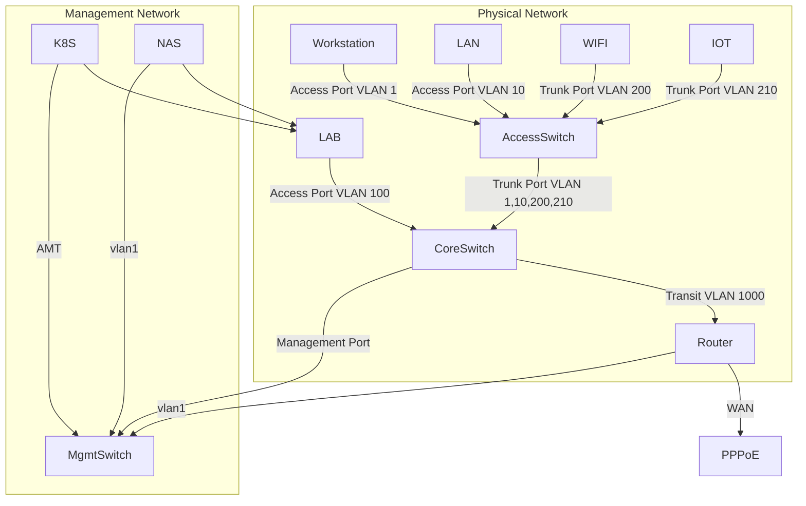

## Service Topology

### Components

- Router / Firewall / DHCP / NTP / DNS / TProxy : `OpenWRT@ESXi`;
- NAS / Infrastructure Services : `Synology DS1825+`;
- EBGP / BFD : `H3C S6520-24S-SI`;
- Computing : `MS-01`;

### Notes

- All LACP devices using `layer 3+4` for better compatibility;
- Enable jumbo frame for `K8S`, `NAS`, `Router`;
- `Vlan-interface100` runs `proxy-arp enable` + `local-proxy-arp enable`: the
  MetalLB pool `10.10.0.128/27` sits *inside* the LAB `/24`, so same-subnet
  clients (workstation, nodes, router VLAN100 leg) ARP for service VIPs
  instead of routing via the switch. Without proxy ARP those ARPs go
  unanswered (BGP mode holds no L2 address) and clients see
  `EHOSTUNREACH`/`No route to host`. Clients on other VLANs and VPN guests
  already route via their gateway, which resolves the `/27` over eBGP.
